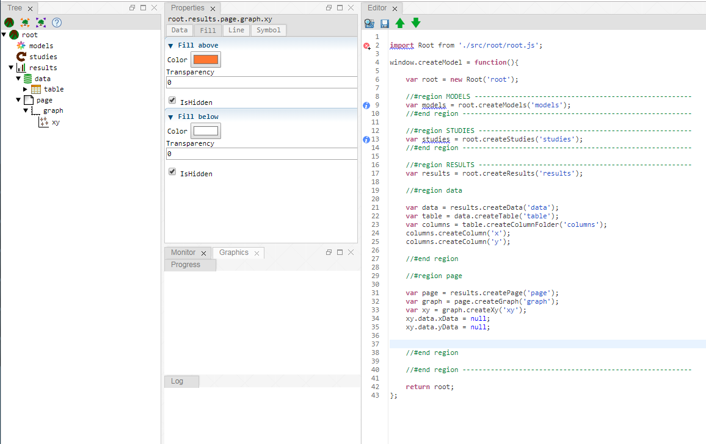

# treezjs
**Treez** is an open source project that helps you to create **tree based Graphical User Interfaces (GUIs)** for (scientific) web applications. The core idea of treez is to provide reusable building blocks (so-called **atoms**) and to organize them in a **tree model**. The tree model can be edited with a [**tree view**](./doc/views/treeView.md). It can also be exported to and imported from a JavaScript [**code editor**](./doc/views/editorView.md). The code representation of the tree model can be stored as text file. 

Treez originally has been developed as Eclipse Plugin (see https://github.com/stefaneidelloth/treez). This github project provides  a **JavaScript implementation of Treez (= treezjs)**. All further development is done here. 

The [atoms](./doc/atoms.md) that come with treez can be used to model a **common simulation work flow**: define an exectuable model that should be run several times, define and execute a (batch) study and finally evaluate the results and plot some figures.

If the already existing atoms are not sufficient for you, please feel free to reuse the **input elements** that come with treez (for example file chooser, color picker, ...) to [implement additional atoms]((./doc/atoms/howToImplementAtoms.md)) for **your own tree based GUI**. 

# Content

* [Installation](./doc/installation.md)
* [User interaction](./doc/userInteraction.md)
* [Views](./doc/views.md)
  * [Tree View](./doc/views/treeView.md)
  * [Properties View](./doc/views/propertiesView.md)
  * [Editor View](./doc/views/editorView.md)
  * [Graphics View](./doc/views/graphicsView.md)
  * [Monitor View](./doc/views/monitorView.md)
* [Atoms](./doc/atoms.md)

