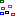
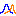

[Content](../README.md)

----

# Atoms

The atoms that come with treez by default represent a typical **modelling workflow** for scientific applications: 
First you define a model, then you define and run some studies and finally you process and evaluate the results. If the
existing atoms are not sufficient for your needs, you might want to [implement custom atoms](./atoms/howToImplementAtoms.md). 

*  [Root](./atoms/root.md)
  *  [Models](./atoms/model/models.md)
    *  [Sweep](./atoms/model/path/path.md)
    *  [GenericInput](./atoms/model/genericInput/genericInput.md)
    *  [Executable](./atoms/model/executable/executable.md)   
    *  [JavaExecutable](./atoms/model/executable/javaExecutable.md)  
    *  [JavaScriptModel](./atoms/model/code/javaScriptModel.md)
    *  [PythonModel](./atoms/model/code/pythonModel.md)
  *  [Studies](./atoms/study/studies.md)
    *  [Sweep](./atoms/study/sweep/sweep.md)
    *  [Sensitivity](./atoms/study/sensitivity/sensitivity.md)
    *  [Picking](./atoms/study/picking/picking.md)
    *  [Probability](./atoms/study/probability/probability.md)
    *  [PythonExport](./atoms/study/pythonExport/pythonExport.md)
    *  [StudyInfoExport](./atoms/study/studyInfoExport/studyInfoExport.md)
  *  [Results](./atoms/result/results.md)

* [How to implement atoms](./atoms/howToImplementAtoms.md)

----

