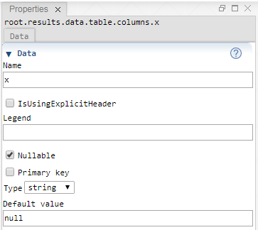

 [ColumnFolder](./columnFolder.md)

----

# Column

The  Column atom represents the column of a table and is used to edit its properties.   




## Source code

[./src/data/column/column.js](../../../src/data/column/column.js)

## Demo

[./demo/data/column/columnDemo.ipynb](../../../../demo/data/column/columnDemo.ipynb)

## Construction

A new  Column atom is created either 

* from the context menu of an existing  ColumnFolder atom in the [Tree View](../../views/treeView.md) or 
* by calling the corresponding factory method of the  ColumnFolder atom in the source code of the [Editor View](../../views/editorView.md):

```javascript
    ...
    let xColumn = columns.createColumn();	     
```

## Sections

### Data

#### Name

The name of the column. The name has to be a valid JavaScript variable name (without spaces, not starting with a number, no reserved key word ect.), so that it can be used as an identifier in the exported source code. 

#### IsUsingExplicitHeader

By default, the column header equals the column name. If you would like to use some differing, explicit header, enable this check box and specify the explicit header. 

#### Explicit header

By default, the column header equals the column name. Explicit headers might be required if the corresponding database column header includes spaces. Use this text field to specify an explicit header. 

#### Legend

The legend of a column might be longer then the name or header. The legend is shown as tooltip when hovering over a table column header. It might also be used by some graphics when plotting the data of the table. 

#### IsNullable

Specifies if null is allowed as value for the column.

#### IsPrimaryKey

Specifies if this column is used as a primary key. 

#### Type

The column type, can be:

* string

* integer

* double

#### Default value

The default value for the entries of the column.

----
[SweepProbe](../../result/probe/sweepProbe.md)
