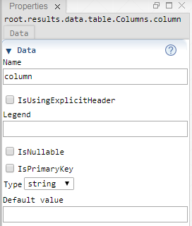

 [ColumnFolder](./columnFolder.md)

----

# Column

The  Column atom represents the column of a table and is used to edit its properties.   




## Source code

[./src/data/column/column.js](../../../src/data/column/column.js)

## Construction

A new  Column atom is created either 

* from the context menu of an existing  ColumnFolder atom in the [Tree View](../../views/treeView.md) or 
* by calling the corresponding factory method of the  ColumnFolder atom in the source code of the [Editor View](../../views/editorView.md):

```javascript
    ...
    let xColumn = columns.createColumn();	     
```

## Sections


----
[SweepProbe](../../result/probe/sweepProbe.md)
