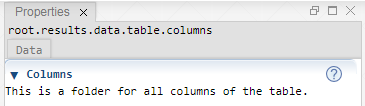

 [Table](../table/table.md)

----

# ColumnFolder

The  ColumnFolder atom serves as a folder for all columns of a table.   



(In future, there might be further child atoms for tables, e.g. for foreign key relations. That is why columns are organized in an extra "column folder".)

## Source code

[./src/data/column/columnFolder.js](../../../src/data/column/columnFolder.js)

## Demo

[./demo/data/column/columnFolderDemo.ipynb](../../../../demo/data/column/columnFolderDemo.ipynb)

## Construction

A new  ColumnFolder atom is created either 

* from the context menu of an existing  Table atom in the [Tree View](../../views/treeView.md) or 
* by calling the corresponding factory method of the  Table atom in the source code of the [Editor View](../../views/editorView.md):

```javascript
    ...
    let columns = table.createColumnFolder();	     
```

## Child atoms

The context menu of the  ColumnFolder atom allows to add child atoms: 

*  [Column](./column.md)

----
[Column](./column.md)
