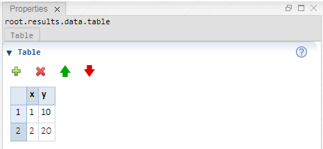

 [Data](../../result/data/data.md)

----

# Table

The  Table atom represents tabular data.   



## Source code

[./src/data/table/table.js](../../../src/data/table/table.js)

## Construction

A new  Table atom is created either 

* from the context menu of an existing  [Data](../../result/data/data.md) atom in the [Tree View](../../views/treeView.md) or 
* by calling the corresponding factory method of the  [Data](../../result/data/data.md) atom in the source code of the [Editor View](../../views/editorView.md):

```javascript
    ...
    let table = data.createTable();	     
```

## Child atoms

The context menu of the  Table atom allows to add child atoms: 

*  [ColumnFolder](../column/columnFolder.md)

----
 [ColumnFolder](../column/columnFolder.md)
