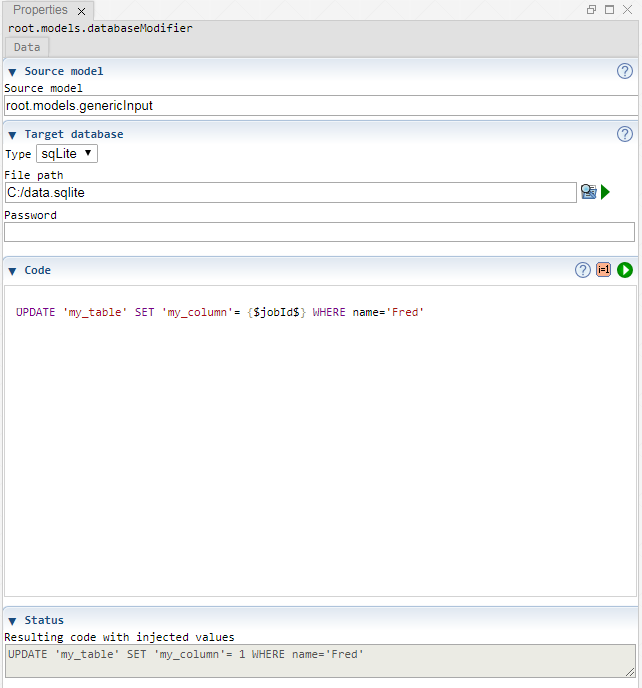

 [Models](../models.md)

----

# DatabaseModifier
		
The purpose of the  DatabaseModifier atom is to modify a database by executing a query.
	

		
## Source code

[./src/model/databaseModifier/databaseModifier.js](../../../../src/model/databaseModifier/databaseModifier.js)

## Construction
		
A new  DatabaseModifier atom is created either by: 

* using the context menu of a  [Models](../models.md) atom in the [Tree View](../../../views/treeView.md) or
* calling the corresponding factory method of the  [Models](../models.md) atom in the source code of the [Editor view](../../../views/editorView.md):

```javascript
    ...
    var databaseModifier = models.createDatabaseModifier();	     
```

## Work flow	

You can **run** the  DatabaseModifier atom either<br> 
a) with the  run button in the upper right corner of the [Properties View](../../../views/propertiesView.md)<br>
b) with the  run button in the context menu of the atom in the [Tree View](../../../views/treeView.md)<br>
c) with the  run button in the context menu of the parent  [Models](../models.md) atom in the [Tree View](../../../views/treeView.md) (runs all executable models)<br>
d) remotely with another atom (e.g. as part of a  [Sweep](../../study/sweep/sweep.md) study. 

			
## Sections

### Source model

The tree path of a model that provides variables (e.g. "root.models.genericInput"). 

Leave this input field empty if you 
* do not want to inject variable values into the query code or you 
* only want to use the ("global") variables jobId and studyId.  

### Code

The query to be executed. The query might contain variable placeholders (e.g. {$jobId$}) that are replaced with the actual variable values before the query is executed. 

### Status

A prview of the resulting query (including injected variable values).

----

 [FileCleanup](../fileCleanup/fileCleanup.md)	
