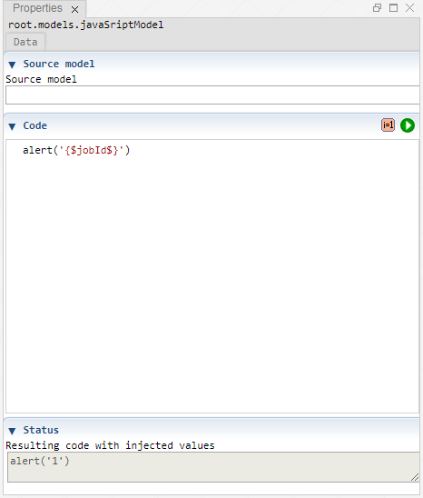

 [Models](../models.md)

----

# JavaScriptModel
		
The purpose of the  JavaScriptModel atom is to execute some JavaScript code.
The code might contain variable placeholders (e.g. {$jobId$}) that are replaced with the actual variable values before the code is executed. 
	

		
## Source code

[./src/model/code/javaScriptModel.js](../../../../src/model/code/javaScriptModel.js)

## Construction
		
A new  JavaScriptModel atom is created either by: 

* using the context menu of a  [Models](../models.md) atom in the [Tree View](../../../views/treeView.md) or
* calling the corresponding factory method of the  [Models](../models.md) atom in the source code of the [Editor view](../../../views/editorView.md):

```javascript
    ...
    var javaScriptModel = models.createJavaScriptModel();	     
```

## Work flow	

You can **run** a  JavaScriptModel atom either<br> 
a) with the  run button in the upper right corner of the [Properties View](../../../views/propertiesView.md)<br>
b) with the  run button in the context menu of the atom in the [Tree View](../../../views/treeView.md)<br>
c) with the  run button in the context menu of the parent  [Models](../models.md) atom in the [Tree View](../../../views/treeView.md) (runs all executable models)<br>
d) remotely with another atom (e.g. as part of a  [Sweep](../../study/sweep/sweep.md) study. 
			
## Sections

### Source model

The tree path of a model that provides variables (e.g. "root.models.genericInput"). 

Leave this input field empty if you 
* do not want to inject variable values in the JavaScript code or you 
* only want to use the ("global") variables jobId and studyId.  

### Code

The code to be executed.

----

 [PythonModel](./pythonModel.md)
