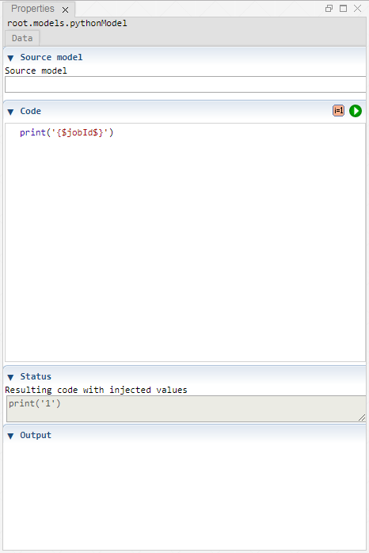

 [Models](../models.md)

----

# PythonModel
  
The purpose of the  PythonModel atom is to execute some python code.
The code might contain variable placeholders (e.g. {$jobId$}) that are replaced with the actual variable values before the code is executed. 

This atom does not work for the [stand-alone](../../../installation/standaloneInstallation.md) installation but only with the 
installation as [Jupyter notebook extension](../../../installation/jupyterInstallation.md).


		
## Source code

[./src/model/code/pythonModel.js](../../../../src/model/code/pythonModel.js)

## Construction
		
A new  PythonModel atom is created either by: 

* using the context menu of a  [Models](../models.md) atom in the [Tree View](../../../views/treeView.md) or
* calling the corresponding factory method of the  [Models](../models.md) atom in the source code of the [Editor view](../../../views/editorView.md):

```javascript
    ...
    let pythonModel = models.createPythonModel();	     
```

## Work flow	

You can **run** a  PythonModel atom either<br> 
a) with the  run button in the upper right corner of the [Properties View](../../../views/propertiesView.md)<br>
b) with the  run button in the context menu of the atom in the [Tree View](../../../views/treeView.md)<br>
c) with the  run button in the context menu of the parent  [Models](../models.md) atom in the [Tree View](../../../views/treeView.md) (runs all executable models)<br>
d) remotely with another atom (e.g. as part of a  [Sweep](../../study/sweep/sweep.md) study. 
			
The code is executed like the code of a cell in the Jupyter Notebook. The (html) output of the code (e.g. a plot) is shown in the section "Output".       
      
## Sections

### Source model

The tree path of a model that provides variables (e.g. "root.models.genericInput"). 

You can use variable placeholders in the code (e.g. {$myVariable$}). The corresponding variable values are injected in the code before executing it.
The section "Status" shows a preview of the code with the injected variable values. 

Leave this input field empty if you 
* do not want to inject any variable values in the JavaScript code or you 
* only want to use the ("global") variables *jobId* and *studyId*.  

### Code

The code to be executed.

### Status

A preview of the code, including injected variable values.

### Output

Shows the (html) output of the python code, for example plots.
This works similar to the output section of python code cells in a Jupyter Notebook. 

----

 [Studies](../../study/studies.md)
