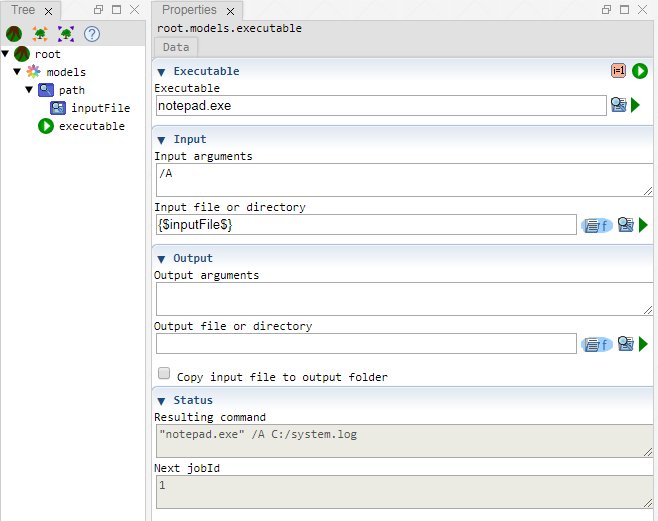

 [Models](../models.md)

----

# Executable
		
The purpose of the  Executable atom is to execute a system command, for example

```
notepad.exe /A C:/system.log 
```
	

		
## Source code

[./src/model/executable/executable.js](../../../../src/model/executable/executable.js)

## Construction
		
A new  Executable atom is created either by: 

* using the context menu of a  [Models](../models.md) atom in the [Tree View](../../../views/treeView.md) or
* calling the corresponding factory method of the  [Models](../models.md) atom in the source code of the [Editor view](../../../views/editorView.md):

```javascript
    ...
    var executable = models.createExecutable();	     
```

## Child atoms
		
The context menu of the  Executable atom allows to add child atoms: 

*  [InputModification](./inputModification.md)
*  [OutputModification](./outputModification.md)
*  [LoggingArguments](./loggingArguments.md)
	
## StudyId and JobId

See the [studyId and jobId](../models.md#studyid-and-jobid) of the  [Models](../models.md) atom. They work similarly.
	
## Work flow	

You can **run** the  Executable atom either<br> 
a) with the  run button in the upper right corner of the [Properties View](../../../views/propertiesView.md)<br>
b) with the  run button in the context menu of the atom in the [Tree View](../../../views/treeView.md)<br>
c) with the  run button in the context menu of the parent  [Models](../models.md) atom in the [Tree View](../../../views/treeView.md) (runs all executable models)<br>
d) remotely with another atom (e.g. as part of a  [Sweep](../../study/sweep/sweep.md) study. 

The creation of the system command can be influenced by adding child atoms.

If the system command writes text to the console, that text will be shown in the [[Monitor View](../../../views/monitorView.md).

The jobId of the  Executable atom is increased by 1 after the execution has been finished.
			
## Arguments

The total system command is created by concatenation from the individual input fields. A prview for the command is shown as **Resulting command** in the section "Status". 

It is possible to use variables (e.g. a  [FilePathVariable](../../variable/field/filePathVariable.md) *inputFile*) that have been defined before. The preview of the status section contains the actual variable values (e.g. C:/system.log) instead of the variable placeholder expressions (e.g {$inputFile$}).

If you use **special characters**, please check if you need to include escape characters for your (nested) command line arguments, e.g. double slashes or quotation marks instead of single ones.

### Executable
		
The path to the **executable** (e.g. \*.exe or \*.bat) file. This path is automatically put in **quotation marks** to ensure that paths that include spaces work correctly. 

Please do not include additional arguments here but use the other input fields. (Otherwise the whole line would be put within quotation marks and the system command might not work.) 

The content of the other input fields is appended to the executable path (separated by spaces). Please have a look at the **status section** to see a preview of the **Resulting command**.

### Input

#### Input arguments

This is typically a **key word**, telling the executable that an input file path follows, e.g. "-i" or "/OPEN". 

Leave this input field empty if your executable does not require such an input key word. 

#### Input file or directory

This is typically the path to an input file or folder, e.g. "C:/input.txt".

You can manually enter the path or [browse the file or directory](../../../components/file/fileOrDirectoryPath.md) on your local disk. 

The input path is not automatically wrapped in quotation marks because some programs do not support quotation marks around the input path. Therefore, if you use an input path that contains spaces, you **might need to manually wrap it in quotation marks**. 

Leave this input field empty if your executable does not require an input file or directory.   	

It is possible to **dynamically modify the input path** using an  [InputModification](./inputModification.md) atom. This makes sense if you run the  Executable atom  many times, for example in a  [Sweep](../../study/sweep/sweep.md) study, and you want to have a **different input path for each run**.

**Input files can be dynamically created** with  [InputFileGenerator](../inputFileGenerator/inputFileGenerators.md) atoms. 

**Input files can be copied** with  [FileCopy](../fileCopy/fileCopy.md) atoms, e.g. to store them with the output. 

### Output

#### Output arguments

This is typically a **key word**, telling the executable that an output file follows, e.g. "-output" or "/O". 

Leave this input field empty if your executable does not require such an output key word.  
			
#### Output file or directory

This is typically the path to an output file or folder, e.g. "C:/output.txt". 

The output path is not automatically wrapped in quotation marks because some programs do not support quotation marks around the output path. Therefore, if you use an output path that contains spaces, you might need to manually wrap it in quotation marks.

Leave this input field empty if your executable does not require an output file or directory.   	

It is possible to **dynamically modify the output path** using an  [OutputModification](./outputModification.md) atom. This makes sense if you run the  Executable atom  many times, for example in a  [Sweep](../../study/sweep/sweep.md) study, and you want to have a **different output path for each run**.

**Old output files and directories can be deleted** with  [FileCleanup](../fileCleanup/fileCleanup.md) atoms. 

### Logging

You can use a   [LoggingArguments](./loggingArguments.md) child atom to specify extra logging arguments. 

----

 [JavaExecutable](./javaExecutable.md)	
