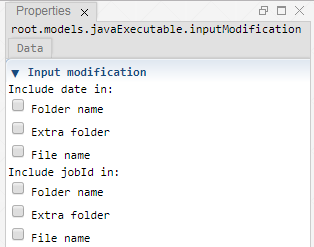

 [Executable](./executable.md)<br>
 [JavaExecutable](./javaExecutable.md)

----

# InputModification

The purpose of the  InputModification atom is to dynamically modify the input file or directory path of its parent atom by including the date and/or jobId.



This makes sense if you run the parent atom many times, for example as part of a  [Sweep](../../study/sweep/sweep.md) study, and you want to have different input paths for each execution.

The check boxes allow you to include the **execution date** and/or a jobId (= increasing number for subsequent runs). 

In order to preview the effect of the individual modification options, you might want to have a look at the **status section** of the parent atom. The actual date probably will be different to the date that is shown in the preview and the jobId might be overridden when remotely running the parent atom as part of a study.  

If you use the  InputModification atom, please make sure that 
* the modified input file or directory paths already exist or 
* that they are dynamically generated before the parent atom is executed, also see  [InputFileGenerator](../inputFileGenerator/inputFileGenerators.md). 

## Source code

[./src/model/executable/inputModification.js](../../../../src/model/executable/inputModification.js)

## Construction
		
A new  InputModification atom is created either by: 

* using the context menu of an  [Executable](./executable.md) or  [JavaExecutable](./javaExecutable.md) atom in the [Tree View](../../../views/treeView.md) or
* calling the corresponding factory method of the parent atom in the source code of the [Editor view](../../../views/editorView.md):

```javascript
    ...
    var inputModification = executable.createInputModification();	     
```

## Arguments

Activate the corresponding check boxes for includeing the date and/or the jobId in the path. (Including the date in the input path is not very common and might only make sense if the input file is dynamically generated immediately before execution.) 

The option **File** is only relevant if the input path is a file path.

The option **Extra directory** means that an extra sub directory is included in the path, for example:

```
C:/input/input.txt  => C:/input/2019-07-24_13:28:19#1/input.txt
```

In order to preview the effect of the individual modification options, you might want to have a look at the status section of the parent atom. 

----

 [OutputModification](./outputModification.md)
