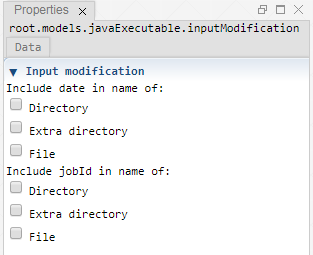

 [Executable](./executable.md)<br>
 [JavaExecutable](./javaExecutable.md)

----

# InputModification

The purpose of the  InputModification atom is to dynamically modify the input file or directory path of its parent atom by including the date and/or jobId.



## Source code

[./src/model/executable/inputModification.js](../../../../src/model/executable/inputModification.js)

## Construction
		
A new  InputModification atom is created either by: 

* using the context menu of an  [Executable](./executable.md) or  [JavaExecutable](./javaExecutable.md) atom in the [Tree View](../../../views/treeView.md) or
* calling the corresponding factory method of the parent atom in the source code of the [Editor view](../../../views/editorView.md):

```javascript
    ...
    var inputModification = executable.createInputModification();	     
```

## Arguments

Activate the corresponding check boxes for includeing the date and/or the jobId in the path. (Including the date in the input path is not very common and might only make sense if the input file is dynamically generated immediately before execution.) 

The option **File** is only relevant if the input path is a file path.

The option **Extra directory** means that an extra sub directory is included in the path, for example:

```
C:/input/input.txt  => C:/input/2019-07-24_13:28:19#1/input.txt
```

----

 [OutputModification](./outputModification.md)
