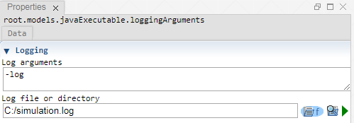

 [Executable](./executable.md)<br>
 [JavaExecutable](./javaExecutable.md)

----

# LoggingArguments

The purpose of the  LoggingArguments atom is to append additional logging arguments to its parent atom.




## Source code

[./src/model/executable/loggingArguments.js](../../../../src/model/executable/loggingArguments.js)

## Construction
		
A new  LoggingArguments atom is created either by: 

* using the context menu of an  [Executable](./executable.md) or  [JavaExecutable](./javaExecutable.md) atom in the [Tree View](../../../views/treeView.md) or
* calling the corresponding factory method of the parent atom in the source code of the [Editor view](../../../views/editorView.md):

```javascript
    ...
    var loggingArguments = executable.createLoggingArguments();	     
```

## Arguments

### Logging arguments

This is typically a **key word**, telling the (Java-) executable that a log file path follows, e.g. "-l" or "/LOG". 

Leave this input field empty if your executable does not require such input key words. 

### Log file or directory

This is typically the path to a log file or directory, e.g. "C:/simulation.log".

You can manually enter the path or [browse the file or directory](../../../components/file/fileOrDirectoryPath.md) on your local disk. 

The log path is not automatically wrapped in quotation marks because some programs do not support quotation marks around the log path. Therefore, if you use a log path that contains spaces, you **might need to manually wrap it in quotation marks**. 

Do not use this atom if your executable does not require any log file or directory.   	

----

 [TableImport](../tableImport/tableImport.md)
