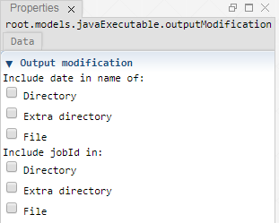

 [Executable](./executable.md)<br>
 [Executable](./javaExecutable.md)

----

# OutputModification

The purpose of the  OutputModification atom is to modify the output file or directory path of its parent atom.




This makes sense if you run the parent atom many times, for example as part of a  [Sweep](../../study/sweep/sweep.md) study, and you want to have different output paths for each execution.

The check boxes allow you to include the **execution date** and/or a jobId (= increasing number for subsequent runs). 

In order to **preview the effect** of the individual modification options, you might want to have a look at the **status section of the parent atom**. The actual date probably **will be different** to the date that is shown in the preview and the jobId might be overridden when remotely running the parent atom as part of a study.  

If you use the  OutputModification atom please make sure that your (Java-) executable is able to automatically create the files and/or directories if they do not yet exist.

## Source code

[./src/model/executable/outputModification.js](../../../../src/model/executable/outputModification.js)

## Construction
		
A new  OutputModification atom is created either by: 

* using the context menu of an  [Executable](./executable.md) or  [JavaExecutable](./javaExecutable.md) atom in the [Tree View](../../../views/treeView.md) or
* calling the corresponding factory method of the parent atom in the source code of the [Editor view](../../../views/editorView.md):

```javascript
    ...
    var outputModification = executable.createOutputModification();	     
```

## Arguments

Activate the corresponding check boxes for includeing the date and/or the jobId in the path. 

The option **File** is only relevant if the output path is a file path.

The option **Extra directory** means that an extra sub directory is included in the path, for example:

```
C:/output/output.txt  => C:/output/2019-07-24_13:28:19#1/output.txt
```


----

 [LoggingArguments](./loggingArguments.md)
