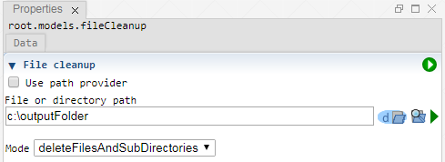

 [Models](../models.md)

----

# FileCleanup
		
The purpose of the  FileCleanup atom is to delete (old) files. It can be applied to
* delete a single file
* delete all files and sub directories in a directory
* delete a directory
	

		
## Source code

[./src/model/fileCleanup/fileCleanup.js](../../../../src/model/fileCleanup/fileCleanup.js)

## Construction
		
A new  FileCleanup atom is created either by: 

* using the context menu of a  [Models](../models.md) atom in the [Tree View](../../../views/treeView.md) or
* calling the corresponding factory method of the  [Models](../models.md) atom in the source code of the [Editor view](../../../views/editorView.md):

```javascript
    ...
    var fileCleanup = models.createFileCleanup();	     
```

## Work flow	

You can **run** the  FileCleanup atom either<br> 
a) with the  run button in the upper right corner of the [Properties View](../../../views/propertiesView.md)<br>
b) with the  run button in the context menu of the atom in the [Tree View](../../../views/treeView.md)<br>
c) with the  run button in the context menu of the parent  [Models](../models.md) atom in the [Tree View](../../../views/treeView.md) (runs all executable models)<br>
d) remotely with another atom (e.g. as part of a  [Sweep](../../study/sweep/sweep.md) study. 

			
## Sections


### Executable

----

 [FileCopy](./fileCopy.md)
