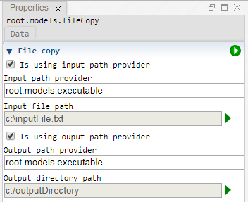

 [Models](../models.md)

----

# FileCopy
		
The purpose of the  FileCopy atom is to copy a file. Use it for example to copy (dynamically created) input files to some output folder. 
	

		
## Source code

[./src/model/fileCleanup/fileCopy.js](../../../../src/model/fileCopy/fileCopy.js)

## Construction
		
A new  FileCopy atom is created either by: 

* using the context menu of a  [Models](../models.md) atom in the [Tree View](../../../views/treeView.md) or
* calling the corresponding factory method of the  [Models](../models.md) atom in the source code of the [Editor view](../../../views/editorView.md):

```javascript
    ...
    var fileCopy = models.createFileCopy();	     
```

## Work flow	

You can **run** the  FileCopy atom either<br> 
a) with the  run button in the upper right corner of the [Properties View](../../../views/propertiesView.md)<br>
b) with the  run button in the context menu of the atom in the [Tree View](../../../views/treeView.md)<br>
c) with the  run button in the context menu of the parent  [Models](../models.md) atom in the [Tree View](../../../views/treeView.md) (runs all executable models)<br>
d) remotely with another atom (e.g. as part of a  [Sweep](../../study/sweep/sweep.md) study. 

			
## Sections

### File copy

#### Use path provider

If this option is enabled a path provider can be selected instead of explicitly specifying a file path. Use this for example if you would like to clean up the (dynamically modified) output path of an  [Executable](../executable/executable.md) atom.

#### Path provider

The tree path of an atom that provides some (output) path to be cleaned.

#### File or directory path

The path to a file or directory to be cleaned. Also see [FileOrDirectoryPath](../../../components/file/fileOrDirectoryPath.md).

#### Mode

If a directory is selected above, the Mode combo box is visible and you can choose a **directory cleanup mode**:
* deleteFiles: Delete all files in the specified directory. Sub directories are not deleted. 
* deleteFilesAndSubDirectories: Delete all files and sub directories in the specified directory.
* deleteDirectory: Delete the specified directory.

----

 [InputFileGenerator](../inputFileGenerator/inputFileGenerator.md)
