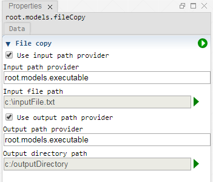

 [Models](../models.md)

----

# FileCopy
		
The purpose of the  FileCopy atom is to copy a file. Use it for example to copy (dynamically created) input files to some output folder. 
	

		
## Source code

[./src/model/fileCopy/fileCopy.js](../../../../src/model/fileCopy/fileCopy.js)

## Construction
		
A new  FileCopy atom is created either by: 

* using the context menu of a  [Models](../models.md) atom in the [Tree View](../../../views/treeView.md) or
* calling the corresponding factory method of the  [Models](../models.md) atom in the source code of the [Editor view](../../../views/editorView.md):

```javascript
    ...
    var fileCopy = models.createFileCopy();	     
```

## Work flow	

You can **run** the  FileCopy atom either<br> 
a) with the  run button in the upper right corner of the [Properties View](../../../views/propertiesView.md)<br>
b) with the  run button in the context menu of the atom in the [Tree View](../../../views/treeView.md)<br>
c) with the  run button in the context menu of the parent  [Models](../models.md) atom in the [Tree View](../../../views/treeView.md) (runs all executable models)<br>
d) remotely with another atom (e.g. as part of a  [Sweep](../../study/sweep/sweep.md) study. 

			
## Sections

### File copy

#### Use input path provider

If this option is enabled, a path provider can be selected instead of explicitly specifying the path of the file to copy. Use this for example if you would like to copy the (dynamically created) input file of an  [Executable](../executable/executable.md) atom.

#### Input path provider

The tree path of an atom that provides the input file path. 

#### Input file path

The path of some file to be copied.

#### Use output path provider

If this option is enabled, a path provider can be selected instead of explicitly specifying a output directory path. 

#### Output path provider

The tree path of an atom that provides the output directory path. 

#### Output file path

The output directory path to where the (input) file should be copied.

----

 [InputFileGenerator](../inputFileGenerator/inputFileGenerator.md)
