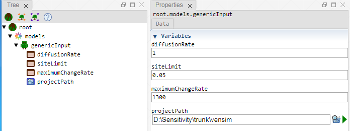

 [Models](../models.md)

----

# GenericInput

The purpose of the  GenericInput atom is to provide a **list of variables** that can be **referenced and used by other atoms** (e.g. by a  [InputFileGenerator](../../model/inputFileGenerator/inputFileGenerator.md) or the ranges for a  [Sweep](../../study/sweep/sweep.md) study). 

If you click on a  GenericInput atom in the [Tree View](../../../views/treeView.md), the values for the variables can be edited in the [Properties View](../../../views/propertiesView.md):



The context menu of the  GenericInput atom in the [Tree View](../../../views/treeView.md) provides actions for adding variables.


## Source code

[/src/model/genericInput/genericInput.js](../../../../src/model/genericInput/genericInput.js)
		
## Construction
		
A new  GenericInput atom is created either by: 

* using the context menu of a  [Models](../models.md) atom in the [Tree View](../../../views/treeView.md) or
* calling the corresponding factory method of the  [Models](../models.md) atom in the source code of the [Editor view](../../../views/editorView.md):

```javascript
    ...
    var genericInput = models.createGenericInput();	     
```

## Child atoms
		
The context menu of the  GenericInput atom allows to add child atoms: 

*  [FilePathVariable](../../variable/field/filePathVariable.md)
*  [DirectoryPathVariable](../../variable/field/directoryPathVariable.md)

----

 [Executable](../executable/executable.md)

