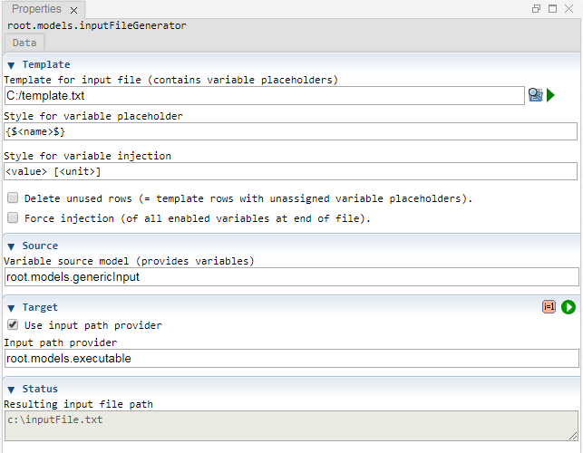

 [Models](../models.md)

----

# InputFileGenerator
		
The purpose of the  InputFileGenerator atom is generate an input text file for  [Executable](../executable/executable.md) atom. 

The generated input file contains some specific variable values, that are provided for example by a  [GenericInput](../genericInput/genericInput.md) atom.
	

		
## Source code

[./src/model/inputFileGenerator/inputFileGenerator.js](../../../../src/model/inputFileGenerator/inputFileGenerator.js)

## Construction
		
A new  InputFileGenerator atom is created either by: 

* using the context menu of a  [Models](../models.md) atom in the [Tree View](../../../views/treeView.md) or
* calling the corresponding factory method of the  [Models](../models.md) atom in the source code of the [Editor view](../../../views/editorView.md):

```javascript
    ...
    var inputFileGenerator = models.createInputFileGenerator();	     
```

## Work flow	

You can **run** the  InputFileGenerator atom either<br> 
a) with the  run button in the upper right corner of the [Properties View](../../../views/propertiesView.md)<br>
b) with the  run button in the context menu of the atom in the [Tree View](../../../views/treeView.md)<br>
c) with the  run button in the context menu of the parent  [Models](../models.md) atom in the [Tree View](../../../views/treeView.md) (runs all executable models)<br>
d) remotely with another atom (e.g. as part of a  [Sweep](../../study/sweep/sweep.md) study. 

The  InputFileGenerator atom makes sense if some  [Executable](../executable/executable.md) atom should be run many times (e.g. as part of a  [Sweep](../../study/sweep/sweep.md) study). For each simulation job, the generic input model is adapted by the study and a new input file is dynamically generated, using the current variable values of the generic input model. 

Once all required information has been put in the single input file, that file is passed to the *.exe executable program.

The  InputFileGenerator:
* reads a template for the input file (=> many types of input files can be generated, e.g. *.txt, *.xml, *json, ect.) 
* loops over all variables of a given variable source model and
  * checks if the template contains a placeholder for the current variable
  * if a matching placeholder is found, the placeholder is replaced by expressions including the current variable value (and unit)
* (optionally deletes "unused rows" of the template: template rows that still contain unused placeholders after the loop has been finished)
* writes the generated text as a new (input) file

The term "input file" might be confusing. In perspective of the  InputFileGenerator, the "input file" actually is the generated file or "output". In perspective of an [Executable](../executable/executable.md) atom it is an input file: once the generated file exists, it can be passed as input to an \*.exe executable. That is where the name "input file" comes from. 

The template file and the variable source model are inputs for the  InputfileGenerator.  
			
## Sections

### File copy

#### Use input path provider

If this option is enabled, a path provider can be selected instead of explicitly specifying the path of the file to copy. Use this for example if you would like to copy the (dynamically created) input file of an  [Executable](../executable/executable.md) atom.

#### Input path provider

The tree path of an atom that provides the input file path. 

#### Input file path

The path of some file to be copied.

#### Use output path provider

If this option is enabled, a path provider can be selected instead of explicitly specifying a output directory path. 

#### Output path provider

The tree path of an atom that provides the output directory path. 

#### Output file path

The output directory path to where the (input) file should be copied.

----

 [Executable](../executable/executable.md)


<h2>InputFileGenerator</h2>
			
		<h3>Purpose</h3>
		
		The purpose of the <a class = "inputFileGenerator"></a> atom is to generate an input text file for 
		the <a class="executable"></a> atom. It might be more comfortable to enter input variables in Treez 
		and generate the input file from the variables instead of manually editing the input file directly. 
		An automatic generation of an input files is needed if its content should change while executing a
		parameter study, e.g. a	<a class="sweep"></a>. The <a class = "inputFileGenerator"></a> takes the
		VariableFields from a <a class = "genericInputModel"></a> and applies them to a template. The template
		and the application of the VariableFields to the template can be customized. This generation strategy 
		provides a very flexible way to produce all kinds of text based input files.   	
		
		<h3>Class name</h3>
		
		org.treez.model.atom.executable.InputFileGenerator
		
		<h3>Construction</h3>
		
		You can create a new <a class = "inputFileGenerator"></a> atom: 
		<ul>
			<li>with the context menu of an existing <a class="executable"></a> atom or</li>
			<li>by calling the corresponding factory method of an <a class="executable"></a> atom:	
			<pre class="prettyprint">InputFileGenerator inputFileGenerator = executable.createInputFileGenerator("inputFileGenerator");</pre>	     
			</li>
		</ul>
		
		<h3>Attributes</h3>
		
		<ul>
			<li><b>Template for input file</b>: The path to a text file that contains the template for the input file. 
			The template text will be copied, modified and saved as the new input file. Here is an example template that
			contains place holders for two variables: 
<pre>totalVolume = {$Total volume$};
correctionFactor = {$factor$};</pre> 
			In this specific example a prefix "{$" and a postfix "$}" are used to identify the variable place holders. 
			You can use this pattern for variable place holders or a custom one (see below).
			</li>
			
			
			<li><b>Variable source model</b>: An existing <a class = "GenericInputModel"></a>) that provides 
			the input for the <a class = "inputFileGenerator"></a></li>. Choose on of the existing <a class = "GenericInputModel"></a>
			with the combo box. The VariableFields of that model will be used to fill the template. Each VariableField 
			provides following attributes: 
			
			<ul>
				<li><b>name</b>, e.g. totalVolume</li>	
				<li><b>label</b>, e.g. Total volume</li>
				<li><b>value</b>, e.g. 42</li>	
				<li><b>unit</b> (optional), e.g. m^3 (If a VariableField does not use a unit at all or the unit of a VariableField
					is not specified, an empty space will be used for the unit.)</li>		
			</ul>
			Those attributes of the VariableFields are first used to identify the place holders in the template file and then
			to inject corresponding expressions.
			
			<li><b>Style for variable place holder</b>: The style/pattern that has to be used in the template file to define
			a variable place holder. For the definition of the place holder style, the above mentioned attributes of the
			VariableFields can be used surrounded by angle brackets. The default place holder style is <code>{$&lt;label&gt;$}</code>
			It identifies a place holder with the variable label surrounded by some special characters. For the example attributes 
			given above the expression <code>{$Total volume$}</code> will be replaced in the template file.
			</li>
			
			<li><b>Style for value and unit injection</b>: The style/pattern that is used for the expressions that are inserted
			into the template. With a pattern <code>&lt;value&gt;&lt;unit&gt;</code> and the example attributes given above, an expression
			<code>42m^3</code> would be inserted for a place holder <code>{$Total volume$}</code> in the template. If you remove the unit tag
			from the pattern, only the value 42 will be used to replace the place holder. If the unit is missing the  <code>&lt;unit&gt;</code>
			tag is replaced by an empty string. Please consider this if you use a style like <code>&lt;value&gt; [&lt;unit&gt;]</code> and
			make sure that the units have proper default values, e.g. "1". 
			</li> 
			
			<li><b>Input file to generate</b>: The output path where the generated input file will be saved.</li>
			
			<li><b>Delete template rows with unassigned variable place holders</b>: If a source model does not provide all variables
			that are used in the template file and this check box is enabled, the rows with the remaining <b>unassigned variable place 
			holders</b> are removed. This feature makes sense if you want to use a global template file that includes all possible 
			variables for your external executable and you only want to use a sub set of those parameters for a distinct study. 
			Only the information about the existing/enabled variables of your source model will be passed to the external executable 
			and the other template rows will be "filtered out". An alternative approach would be to specify default values for all 
			variables and to always pass all variables to the external executable. 
			</li>
			
</ul>
