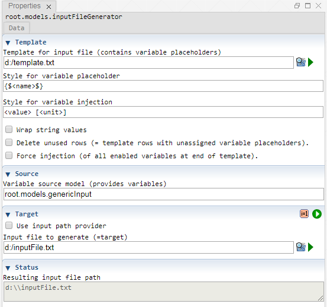

 [Models](../models.md)

----

# InputFileGenerator
		
The purpose of the  InputFileGenerator atom is generate an input text file for  [Executable](../executable/executable.md) atom. 

The generated input file (= target) contains variable values. Those values are typlically provided by a  [GenericInput](../genericInput/genericInput.md) atom (= source).
	


The transformation from the source variable model to the target input file is described by a template, using placeholders and some styles. This generation strategy provides a very flexible way to produce all kinds of text based input files (\*.txt, \*.xml, \*.json, ...).  

		
## Source code

[./src/model/inputFileGenerator/inputFileGenerator.js](../../../../src/model/inputFileGenerator/inputFileGenerator.js)

## Construction
		
A new  InputFileGenerator atom is created either by: 

* using the context menu of a  [Models](../models.md) atom in the [Tree View](../../../views/treeView.md) or
* calling the corresponding factory method of the  [Models](../models.md) atom in the source code of the [Editor view](../../../views/editorView.md):

```javascript
    ...
    var inputFileGenerator = models.createInputFileGenerator();	     
```

## Work flow	

You can **run** the  InputFileGenerator atom either<br> 
a) with the  run button in the upper right corner of the [Properties View](../../../views/propertiesView.md)<br>
b) with the  run button in the context menu of the atom in the [Tree View](../../../views/treeView.md)<br>
c) with the  run button in the context menu of the parent  [Models](../models.md) atom in the [Tree View](../../../views/treeView.md) (runs all executable models)<br>
d) remotely with another atom (e.g. as part of a  [Sweep](../../study/sweep/sweep.md) study. 

The  InputFileGenerator atom makes sense if some  [Executable](../executable/executable.md) atom should be run many times (e.g. as part of a  [Sweep](../../study/sweep/sweep.md) study). For each simulation job, the (generic) input model is adapted by the study and a new input file is dynamically generated, using the current variable values of the (generic) input model. 

Once all required information has been put in a single input file for the current job, that file is passed to the \*.exe executable program.

The  InputFileGenerator:
* reads a template for the input file 
* loops over all variables of a given variable source model and
  * checks if the template contains a placeholder for the current variable
  * if a matching placeholder is found, the placeholder is replaced by concrete values (see [Style for variable injection](./inputFileGenerator.md#style-for-variable-injection))
* (optionally deletes "unused rows" of the template: template rows that still contain unused placeholders after the loop has been finished)
* (optionally injects all variable expressions without checking the existance of placeholders)
* writes the generated text as a new (input) file

Please note that the term "input file" might be confusing. In perspective of the  InputFileGenerator, the "input file" is the generated file or "output". In perspective of an [Executable](../executable/executable.md) atom, the "input file" actually is the input. That is where the name "input file" comes from. 
			
## Sections

### Template

#### Template for input file

The path to a text file that is used as a template for the generated input file. The text of the template file typically includes variable placeholders. Those placeholders are replaced when creating the input file from the template. 

You can leave the path empty if your input files have a plain structure that can be generated with the option [Force injection](./inputFileGenerator.md#force-injection).

Example template, including placeholders for variables x, y, z, lever:

```
<xml>
  <header>
  	This is an input file for foo.exe
  </header>
   
  <scenario>
  	<variable name="x", value="{$x$}">
	<variable name="y", value="{$y$}">
	<variable name="z", value="{$z$}">
  </scenario>
  
  <policy>
  	<variable name="lever", value="{$lever$}">	
  </policy>
</xml>
```

#### Style for variable placeholder

In order to be able to identify variable placeholders in the template file, those placeholder have to follow the style that is given here. By default, the name of the variable (denoted by the \<name\> tag) is wrapped within {$ and $}:

```
{$<name>$}	
```

=>When trying to inject a variable *x*, the InputFileGenerator looks for a placeholder *{$x$}* in the template.

If you prefer to identify placeholders differently (e.g. because your template already uses the symbol $ for a different purpose), please adapt the style for the variable placeholder, e.g.

```
%<name>	
```

#### Style for variable injection

This style defines how a found variable placeholder of the template is replaced. The style supports following predefined tags:
* \<name\>: the name of the variable
* \<value\>: the value of the variable 
  * for QuantityVariables the numeric value is used
  * for string based variables the value might be wrapped, depending on the setting "Wrap string values"
  * for BooleanVariables *true* or *false* is injected ( if instead *True* or *False* or *1* or *0* is required, please use some other variable type, e.g. StringItemVariable or IntegerVariable.) 
* \<unit\>: the unit of a QuanityVariable (e.g. "kg") or the default unit "1" for variables without unit.

Some examples:

a) Only inject the (numeric) value:

```
<value> 	
```

b) Inject the (numeric) value, a space, and the unit wrapped in square brackets:
```
<value> [<unit>] 	
```

c) Inject variable assignments. 

```
var <name> = <value>;\n  	
```

The last style might be useful if you use the option [Force injection](./inputFileGenerator.md#force-injection).

#### Wrap string value

If this option is enabled, string values are wrapped within the given string wrapper symbol (e.g. quotation marks).

#### String wrapper

Some expression that is used to wrap string values in the input file, e.g. *"*, *'* or *`*.

#### Delete unused rows

Lets assume that our template file supports 200 variables and that we only use a subset (e.g. 5) of those variables in our tree model. Lets further assume, that each variable only corresonds to a single row in the template file.

After injecting our 5 variable values, we would like to remove all the rows that still contain placeholders, because: 
* we do not need that unused rows in the input file
* the remaining placeholders might cause errors.

Therefore, in order to clean up the generated input file, you can activate the option "Delete unused rows".

If a variable corresponds to several rows, this cleanup option does not work. Then you might need to manually adapt the template file if the used/enabled variables change. 

#### Force injection

A disadvantage of the approach with the template file is that we might need to adapt the template every time we add a new variable. If the structure of the template is quite simple, it might be sufficient to work without any placeholders. 

If you enable the option "Force injection", the InputFileGenerator loops over all variables and injects the variables
* without previously checking if the template includes a corresponding placeholder for a variable and
* using the "Style for variable injection" 

### Source

#### Variable source model

The tree path to a model that provides variables, e.g. "root.models.genericInput". The InputFileGenerator loops over all the enabled variables and tries to inject them in the template file. 

### Target

#### Use input path provider

If this option is enabled, a path provider can be selected instead of explicitly specifying the path of the input file to generate. 

#### Input path provider

The tree path of an atom that provides the path of the input file to generate. 

#### Input file to generate

The path of the input text file to generate (e.g. C:/inputFile.txt or C:/inputParameters.xml) 

### Status

#### Resulting input file path

A preview of the used path for the input file to generate. This is useful, if 
* the path is not explicitly specified but variables are used or 
* the path is provided by another atom (= input path provider). 

----

 [Executable](../executable/executable.md)
