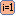

 [Root](../root.md)

----

# Models

The  Models atom represents a branch for all underlying model atoms. Creating the models is 
typically the first step in a simulation work flow. 


Model atoms inherit from [./src/model/model.js](../../../src/model/model.js) and the  Models atom istself is also a model that can be executed. Executing a  Models atom simply means that all of its runnable child atoms are executed.

## Source code

[./src/model/models.js](../../../src/model/models.js)

## Construction

A new  Models atom is created either 


* from the context menu of an existing  [Root](../root.md) atom in the [Tree View](../../views/treeView.md) or 

* by calling the corresponding factory method of the  [Root](../root.md) atom in the source code of the [Editor View](../../views/editorView.md):	

```javascript
    ...
    var models = root.createModels();	     
```

## Child atoms

The context menu of the  Models atom allows to add child atoms: 

*  [Path](./path/path.md)
*  [GenericInput](./genericInput/genericInput.md)
*  [DatabaseModifier](./code/databaseModifier.md)
*  [Executable](./executable/executable.md) 
*  [JavaExecutable](./executable/javaExecutable.md)  	
*  [TableImport](./tableImport/tableImport.md)
*  [SqLiteAppender](./sqLiteAppender/sqLiteAppender.md) 
*  [JavaScriptModel](./code/javaScriptModel.md)
*  [PythonModel](./code/pythonModel.md)


## StudyId and JobId

The  Models atom has two properties that are used to differentiate
subsequent runs:

### StudyId

The property *studyId* is only used if a model is remotely executed as part of a study. The *studyId* cannot be manually specified in the [Properties View](../../views/propertiesView.md) for a model but is specified in the [Properties View](../../views/propertiesView.md) for a study. While executing a study, the *studyId* is automatically injected to the models. The models are able to apply the *studyId* when generating results. If a model is manually executed, the *studyId* is *undefined*.

### JobId

The property *jobId* is 1 by default. If a model is manually executed by a user, the *jobId* is **automatically increased by one after the current job (=model run) has been finished**. 

You can **reset the jobId** with the  "Reset jobId to 1" button of the  Models atom. 

You can see the *jobId* for the next run in the [Properties View](../../views/propertiesView.md) for the  Models atom.

If a model is remotely executed as part of a study or as part of a parent model, a parent *jobId* is determined and the local/manual *jobId* is overwritten. 

## Work flow 

You can **execute** the  Models atom either<br> 
a) with the  run button in the upper right corner of the [Properties View](../../../views/propertiesView.md) or<br>
b) with the  run button in the context menu of the atom in the [Tree View](../../../views/treeView.md) or<br>
c) remotely with another atom (e.g. as part of a  [Sweep](../../study/sweep/sweep.md) study. 

Executing a  Models atom simply means that all of its runnable child atoms are executed. 
The progress is shown in the [Monitoring View](../../../views/monitoringView.md). After the execution has been finished, the *jobId* is automatically increased by one.  


----
 [Studies](../study/studies.md)
