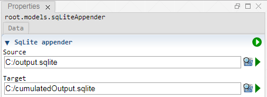

 [Models](../models.md)

----

# SqLiteAppender
		
The purpose of the  SqLiteAppender atom is to append a whole source SqLite database to target SqLite database.
while executing a study. 

The target database might initially be empty. The required tables are created if they do not yet exist. 

In order to distinguish the data from subsequent sources, the source tables are extented with two columns *study_id*, *job_id*.
The extended tables are then attached to the target database. 

The  SqLiteAppender is only thought for small amounts of data and might be very slow for large databases. The current implementation is done in the client and all the data is send back and forth through string based http requests. 
	

		
## Source code

[./src/model/sqLiteAppender/databaseAppender.js](../../../../src/model/sqLiteAppender/sqLiteAppender.js)

## Construction
		
A new  SqLiteAppender atom is created either by: 

* using the context menu of a  [Models](../models.md) atom in the [Tree View](../../../views/treeView.md) or
* calling the corresponding factory method of the  [Models](../models.md) atom in the source code of the [Editor view](../../../views/editorView.md):

```javascript
    ...
    var sqLiteAppender = models.createSqLiteAppender();	     
```

## Work flow	

You can **run** the  SqLiteAppender atom either<br> 
a) with the  run button in the upper right corner of the [Properties View](../../../views/propertiesView.md)<br>
b) with the  run button in the context menu of the atom in the [Tree View](../../../views/treeView.md)<br>
c) with the  run button in the context menu of the parent  [Models](../models.md) atom in the [Tree View](../../../views/treeView.md) (runs all executable models)<br>
d) remotely with another atom (e.g. as part of a  [Sweep](../../study/sweep/sweep.md) study. 

----

 [JavaScriptModel](../code/javaScriptModel.md)
