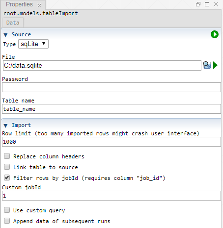

 [Models](../models.md)

----

# TableImport
			
The purpose of the  TableImport atom is to import external data as a table. 

The imported table is attached as child to the  TableImport atom. If the TableImport is executed remotely, for example as part of a  [Sweep](../../study/sweep/sweep.md) study, the table is also returned as model output and probably attached to the data in the  [Results](../../result/results.md) branch of the tree.  


		
## Source code

[./src/model/tableImport/tableImport.js](../../../../src/model/tableImport/tableImport.js)

## Construction
		
A new  TableImport atom is created either by: 

* using the context menu of a  [Models](../models.md) atom in the [Tree View](../../../views/treeView.md) or
* calling the corresponding factory method of the  [Models](../models.md) atom in the source code of the [Editor view](../../../views/editorView.md):

```javascript
    ...
    var tableImport = models.createTableImport();	     
```
		
## Work flow	

You can **run** the  TableImport atom either<br> 
a) with the  run button in the upper right corner of the [Properties View](../../../views/propertiesView.md)<br>
b) with the  run button in the context menu of the atom in the [Tree View](../../../views/treeView.md)<br>
c) with the  run button in the context menu of the parent  [Models](../models.md) atom in the [Tree View](../../../views/treeView.md) (runs all executable models)<br>
d) remotely with another atom (e.g. as part of a  [Sweep](../../study/sweep/sweep.md) study. 
			
## Sections	

### Source

#### Type

Choose if you want to import the data from csv, sqLite or mySql (not yet implemented).

The visibility of the following arguments might depend on the source type.

#### File

The path to a \*.csv or \*.sqlite file (not relevant for the source type mySql).

#### Column seperator

The column separator that is used in the \*.csv file to import. Default is ",".

#### Host

The host name or IP address of a MySQL server, for example "fooserver" or "153.96.123.456".

#### Port

The port number of a MySQL server, for example 3306.

#### User

The user name, for example "root". 

#### Password

A password only needs to be specified if a source database is password protected.

#### Schema name

A single MySQL database can inlcude several "sub databases", called "schema".
Please specifiy the name of the schema that contains the table you would like
to import. 

#### Table name

The name of the database table to be imported (not relevant for the source type csv)

### Import

#### Row limit

The maximum number of rows to import. 

Some databse tables might contain millions of rows. The transfer of data from the Treez server to the client application in the browser might be a bottle neck. Importing too many rows might slow down or crash the client application in the browser. The purpose of the row limit is to avoid those issues. 

If you want to import more then 1000 rows you might want to check if all that data is really relevant for your studies. Mabe you can filter the data before importing a subset. 

#### Replace column headers

Select this option if you would like to replace the column headers of imported table. 

#### Custom column headers

Specify the new column headers that you want to use for the imported table, for example 
```
id,name,age 
```

The number of specified headers needs to be equal to the number of imported columns. 

#### Link table to source

For large tables it might make sense to link the imported table to the original source (not supported for source type csv).
Then it is possible to only load an initial page (consiting for example of 1000 rows) and load more data lazily (e.g. if a user
switches to the text page). 

This option does not make sense if your study always overwrites the results of the previously executed job and you would like to import the data of the individual jobs. The linked table would only represent the last state of the source database.  

#### Filter rows by jobId

Enable this option if you would like to import only those rows that include a specific jobId in the column "job_id".
As a prequequisit, the data source must contain a column "job_id".

#### Custom jobId

If a TableImport is remotely executed as part of a study, the jobId is automatically injected/overwritten. That injected jobId is also used for filtering the imported rows (if enabled). 

The input field "Custom jobId" is thought for the case when you would like to manually execute or test a TableImport atom.

#### Use custom query

Enable this option if you would like to specify a custom query to be used for importing the data (not supported for source type csv).

#### Custom query

Specify a query to be used for the import, for example

```
SELECT * FROM my_table WHERE age > 3
```

#### Append data of subsequent runs

If the TableImport is run several times, the default behaviour is that already imported data is deleted before importing new data. If you instead want to append the data of subsequent runs/jobs, please enable this option. 

----

 [SqLiteAppender](../sqLiteAppender/sqLiteAppender.md)   
