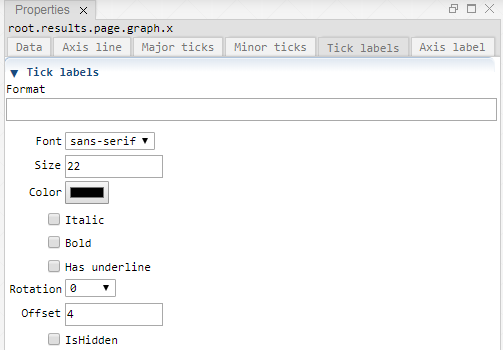

 [Graph](../graph/graph.md)

----

# Axis

The  Axis atom represents a plot axis.<br>
Typically, each  [Graph](../graph/graph.md) atom has two Axis children, a horizontal an a vertical one. Furthermore, plots (e.g.  [XY](../xy/xy.md)) need to reference those axis. 

## Source code

[./src/result/axis/axis.js](../../../../src/result/axis/axis.js)

## Demo

[./demo/result/axis/axisDemo.ipynb](../../../../demo/result/axis/axisDemo.ipynb)

## Construction
		
A new  Axis is created either by: 

* using the context menu of a  [Graph](../graph/graph.md) atom in the [Tree View](../../../views/treeView.md) or
* calling the corresponding factory method of the  [Graph](../graph/graph.md) atom in the source code of the [Editor view](../../../views/editorView.md):

```javascript
    ...
    let axis = graph.createAxis();	
```

# Screenshots of Property View

<table>
<tr>

</tr>	

<tr>

</tr>	

<tr>
	
</tr>	

<tr>
	
</tr>	

<tr>
	
</tr>	

<tr>
	
</tr>	

</table> 

----

 [Xy](../xy/xy.md)

