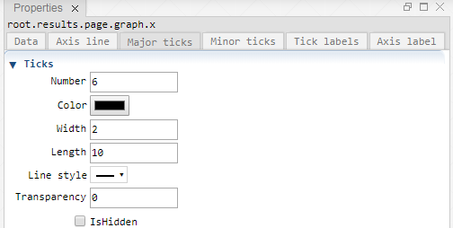
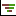

 [Graph](../graph/graph.md)

----

# Axis

The  Axis atom represents a plot axis.
A  [Graph](../graph/graph.md) atom should have two Axis children.


<table>
<tr>

</tr>	

<tr>

</tr>	

<tr>
	
</tr>	

<tr>
	
</tr>	

<tr>
	
</tr>	

<tr>
	
</tr>	

</table> 

## Source code

[./src/result/axis/axis.js](../../../../src/result/axis/axis.js)

## Demo

[./demo/result/axis/axisDemo.ipynb](../../../../demo/result/axis/axisDemo.ipynb)

## Construction
		
A new  Axis is created either by: 

* using the context menu of a  [Graph](../graph/graph.md) atom in the [Tree View](../../../views/treeView.md) or
* calling the corresponding factory method of the  [Graph](../graph/graph.md) atom in the source code of the [Editor view](../../../views/editorView.md):

```javascript
    ...
    let axis = graph.createAxis();	     
```

## Child atoms

The context menu of the  Axis atom allows to add child atoms: 

*  [Axis](../axis/axis.md)
*  [Xy](../xy/xy.md)
*  [XySeries](../xySeries/xySeries.md)
*  [Bar](../bar/bar.md)
*  [Tornado](../tornado/tornado.md)
*  [Legend](../legend/legend.md)

## Properties

### Data

#### Left margin

Distance from the left side of the parent Graph, e.g. 1 cm. (For supported svg units see [here](https://www.w3.org/TR/css3-values/#absolute-lengths) and [here](https://www.w3.org/TR/css3-values/#relative-lengths).) 

#### Top margin

Distance from the top of the parent Graph, e.g. 1 cm. 

#### Width

The width of the Axis, e.g 12 cm.

#### Height

The height of the Axis, e.g 12 cm.

#### IsHidden

Enable this checkbox if you would like to hide the Axis.

### Background

#### Color

The background/fill color of the axis.

#### Transparency

The transparency of the background. The minimum value 0 means no transparency and the maximum value 1 means full transparency.

#### IsHidden

Enable this checkbox (or set Transparency to 1) if you would like to hide the backround fill.

### Border

#### Color

The color of the border.

#### Width

The width of the border, e.g. 2. (The default svg unit is px.)

#### Style

The line style of the border, e.g. solid or dotted.

#### Transparency

The transparency of the border. The minimum value 0 means no transparency and the maximum value 1 means full transparency.

#### IsHidden

Enable this checkbox (or set Transparency to 1) if you would like to hide the border.

----

 [Axis](../axis/axis.md)

