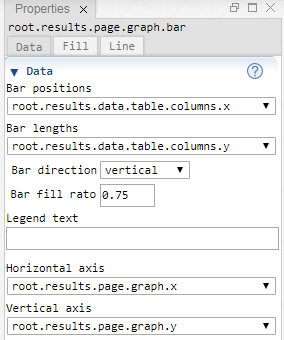
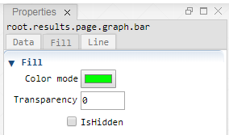
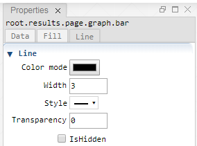

 [Graph](../graph/graph.md)

----

# Bar

The  Bar atom represents a bar plot.<br>

## Source code

[./src/result/bar/bar.js](../../../../src/result/bar/bar.js)

## Demo

[./demo/result/bar/barDemo.ipynb](../../../../demo/result/bar/barDemo.ipynb)

## Construction
		
A new  Bar is created either by: 

* using the context menu of a  [Graph](../graph/graph.md) atom in the [Tree View](../../../views/treeView.md) or
* calling the corresponding factory method of the  [Graph](../graph/graph.md) atom in the source code of the [Editor view](../../../views/editorView.md):

```javascript
    ...
    let bar = graph.createBar();	
```

# Screenshots of Property View

<table>
<tr>

</tr>	

<tr>

</tr>	

<tr>

</tr>	

</table> 

----

 [Tornado](../tornado/tornado.md)

