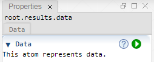

 [Results](../results.md)

----

# Data

The  Data atom represents a tree branch for collecting simulation results and for post processing those results.  



## Source code

[./src/result/data/data.js](../../../src/result/data/data.js)

## Construction

A new  Data atom is created either 

* from the context menu of an existing  Results atom in the [Tree View](../../views/treeView.md) or 
* by calling the corresponding factory method of the  Results atom in the source code of the [Editor View](../../views/editorView.md):

```javascript
    ...
    let data = results.createData();	     
```

## Child atoms

The context menu of the  Data atom allows to add child atoms: 

*  [Table](./table/table.md)
*  [Page](./page/page.md)


----
[Table](./table/table.md)
