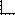
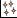
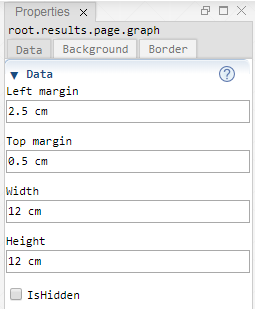
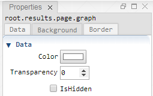
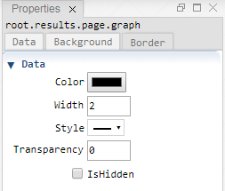
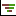

 [Results](../results.md)

----

# Graph

A  Graph is bascially a rectangular region having some position, size and color. 
A  Page can include several  Graphs and a   Graph can include several plots (e.g.  [Xy](../xy/xy.md)). 

<html>
	<table>
		<th>
			<td>
				
			</td>
		
			<td>
				 
			</td>
			
			<td>
				
			</td>
		</th>
	</table>
</html>
 

## Source code

[./src/result/graph/graph.js](../../../../src/result/graph/graph.js)

## Demo

[./demo/result/graph/graphDemo.ipynb](../../../../demo/result/graph/graphDemo.ipynb)

## Construction
		
A new  Graph is created either by: 

* using the context menu of a  [Page](../page/page.md) atom in the [Tree View](../../../views/treeView.md) or
* calling the corresponding factory method of the  [Page](../page/page.md) atom in the source code of the [Editor view](../../../views/editorView.md):

```javascript
    ...
    let graph = page.createGraph();	     
```

## Child atoms

The context menu of the  Graph atom allows to add child atoms: 

*  [Axis](../axis/axis.md)
*  [Xy](../xy/xy.md)
*  [XySeries](../xySeries/xySeries.md)
*  [Bar](../bar/bar.md)
*  [Tornado](../tornado/tornado.md)
*  [Legend](../legend/legend.md)

## Properties

### Data

#### Left margin

Distance from the left side of the parent Page, e.g. 1 cm. (For supported svg units see [here](https://www.w3.org/TR/css3-values/#absolute-lengths) and [here](https://www.w3.org/TR/css3-values/#relative-lengths).) 

#### Top margin

Distance from the top of the parent Page, e.g. 1 cm. 

# Width

The width of the Graph, e.g 12 cm.

# Height

The height of the Graph, e.g 12 cm.

#### IsHidden

Enable this checkbox if you would like to hide the Graph.

### Background

#### Color

The background/fill color of the graph.

#### Transparency

The transparency of the background. The minimum value 0 means no transparency and the maximum value 1 means full transparency.

#### IsHidden

Enable this checkbox (or set Transparency to 1) if you would like to hide the backround fill.

### Border

#### Color

The color of the border.

# Width

The width of the border, e.g. 2. (The default svg unit is px.)

# Style

The line style of the border, e.g. solid or dotted.

#### Transparency

The transparency of the border. The minimum value 0 means no transparency and the maximum value 1 means full transparency.

#### IsHidden

Enable this checkbox (or set Transparency to 1) if you would like to hide the border.

----

 [Axis](../axis/axis.md)

