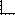

 [Graph](../graph/graph.md)

----

# Legend

The  Legend atom represents a plot legend.<br>

## Source code

[./src/result/legend/legend.js](../../../../src/result/legend/legend.js)

## Demo

[./demo/result/legend/legendDemo.ipynb](../../../../demo/result/legend/legendDemo.ipynb)

## Construction
		
A new  Legend is created either by: 

* using the context menu of a  [Graph](../graph/graph.md) atom in the [Tree View](../../../views/treeView.md) or
* calling the corresponding factory method of the  [Graph](../graph/graph.md) atom in the source code of the [Editor view](../../../views/editorView.md):

```javascript
    ...
    let legend = graph.createLegend();	
```

# Screenshots of Property View

<table>
<tr>

</tr>	

<tr>

</tr>	

<tr>
	
</tr>	

<tr>
	
</tr>	

</table> 

----

 [Results](../results/results.md)

