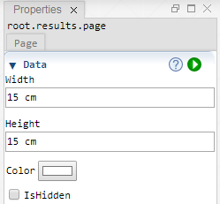

 [Results](../results.md)

----

# Page

The  Page atom is the entry point for creating content of the Graphics View. 



## Source code

[./src/result/page/page.js](../../../../src/result/page/page.js)

## Demo

[./demo/result/page/pageDemo.ipynb](../../../../demo/result/page/pageDemo.ipynb)

## Construction
		
A new  Page is created either by: 

* using the context menu of a  [Results](../results.md) atom in the [Tree View](../../../views/treeView.md) or
* calling the corresponding factory method of the  [Results](../results.md) atom in the source code of the [Editor view](../../../views/editorView.md):

```javascript
    ...
    let page = results.createPage();	     
```

## Child atoms

The context menu of the  Page atom allows to add child atoms: 

*  [Axis](../axis/axis.md)
*  [Xy](../xy/xy.md)
*  [XySeries](../xySeries/xySeries.md)
*  [Bar](../bar/bar.md)
*  [Tornado](../tornado/tornado.md)
*  [Legend](../legend/legend.md)


## Sections

### Data

#### Width

The width of the page. For supported svg units see [here](https://www.w3.org/TR/css3-values/#absolute-lengths) and [here](https://www.w3.org/TR/css3-values/#relative-lengths) 

#### Height

The height of the page. For supported svg units see [here](https://www.w3.org/TR/css3-values/#absolute-lengths) and [here](https://www.w3.org/TR/css3-values/#relative-lengths) 

#### Color

The background color of the page

#### IsHidden

Enable this checkbox if you would like to hide the page.

----

 [Graph](../graph/graph.md)

