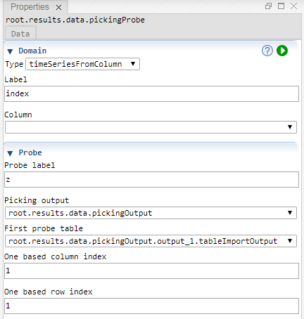

 [Data](../../result/data/data.md)

----

# PickingProbe

Lets assume that a model run does not yield a single number but a whole table and that we
want to create a simple 2D diagram to visualize the output of a Picking study. In order to do so,
we should focus on a single cell of the output table and collect it over all model runs.   

The  PickingProbe loops over the output tables of a Picking study,
picks a specific output value and maps it to the corresponding input values. The collected values 
yield a new table, including data from several model runs.  

The generated probe table can be understood as an intermediate step to visualize dependencies of
Pickingstudies in terms of XySeries plots. 



## Source code

[./src/result/probe/pickingProbe.js](../../../../src/result/probe/pickingProbe.js)

## Demo

[./demo/study/probe/pickingProbeDemo.ipynb](../../../../demo/study/probe/pickingProbeDemo.ipynb)

## Construction
		
A new  PickingProbe is created either by: 

* using the context menu of a  [Data](../../data/data.md) atom in the [Tree View](../../../views/treeView.md) or
* calling the corresponding factory method of the  [Data](../../data/data.md) atom in the source code of the [Editor view](../../../views/editorView.md):

```javascript
    ...
    let pickingProbe = data.createPickingProbe();	     
```

## Sections

### Domain

#### Type

Specifies how the domain values for the generated probe table are determined:

* **sampleIndex**: The index of the Samples of a Picking study is used to determine the domain values. 
* **timeSeriesFromPicking**: The time range of a time dependent Picking study is used to determine the domain values.
* **timeSeriesFromColumn**: An extra, already existng column is used to determine the domain values. 

#### Label

The header for the domain column of the generated probe table. 

### Probe

#### Probe label

The header for the probe column of the generated probe table. 

#### Pickingoutput

The SeepOutput atom, representing the output of a Picking study.

#### First probe table

The first otuput table that is considered for the probe. 

#### One based column index

Specifiy this number to identify the column from which probe value should be picked. 

#### One based row index

Specifiy this number to identify the row from which probe value should be picked. 

----

 [SensitivityProbe](./sensitivityProbe.md)

