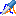

 [Data](../../result/data/data.md)

----

# ProbabilityProbe

TODO: The Probability probe still needs to be implemented. 

Lets assume that a model run does not yield a single number but a whole table and that we
want to create a simple 2D diagram to visualize the output of a Probability study. In order to do so,
we should focus on a single cell of the output table and collect it over all model runs.   

The  ProbabilityProbe loops over the output tables of a Probability study,
picks a specific output value and maps it to the corresponding input values. The collected values 
yield a new table, including data from several model runs.  

The generated probe table can be understood as an intermediate step to visualize dependencies of
Probabilitystudies in terms of XySeries plots. 


## Source code

[./src/result/probe/probabilityProbe.js](../../../../src/result/probe/probabilityProbe.js)

## Demo

[./demo/study/probe/probabilityProbeDemo.ipynb](../../../../demo/study/probe/probabilityProbeDemo.ipynb)

## Construction
		
A new  ProbabilityProbe is created either by: 

* using the context menu of a  [Data](../../data/data.md) atom in the [Tree View](../../../views/treeView.md) or
* calling the corresponding factory method of the  [Data](../../data/data.md) atom in the source code of the [Editor view](../../../views/editorView.md):

```javascript
    ...
    let probabilityProbe = data.createProbabilityProbe();	     
```

## Properties

TODO

----

 [Page](../page/page.md)

