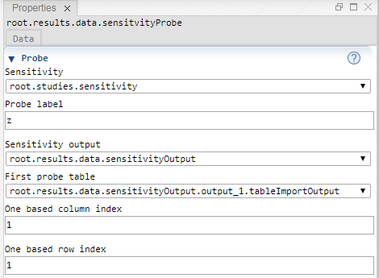

 [Data](../../result/data/data.md)

----

# SensitivityProbe

Lets assume that a model run does not yield a single number but a whole table and that we
want to create a simple 2D diagram to visualize the output of a Sensitivity study. In order to do so,
we should focus on a single cell of the output table and collect it over all model runs.   

The  SensitivityProbe loops over the output tables of a Sensitivity study,
picks a specific output value and maps it to the corresponding input values. The collected values 
yield a new table, including data from several model runs.  

The generated probe table can be understood as an intermediate step to visualize dependencies of
Sensitivity studies in terms of Tornado plots. 



## Source code

[./src/result/probe/sensitivityProbe.js](../../../../src/result/probe/sensitivityProbe.js)

## Demo

[./demo/study/probe/sensitivityProbeDemo.ipynb](../../../../demo/study/probe/sensitivityProbeDemo.ipynb)

## Construction
		
A new  SensitivityProbe is created either by: 

* using the context menu of a  [Data](../../data/data.md) atom in the [Tree View](../../../views/treeView.md) or
* calling the corresponding factory method of the  [Data](../../data/data.md) atom in the source code of the [Editor view](../../../views/editorView.md):

```javascript
    ...
    let sensitivityProbe = data.createSensitivityProbe();	     
```

## Sections

### Probe

#### Sensitivity

The tree path to the Sensitivity study. 

#### Probe label

The header for the probe column of the generated probe table. 

#### Sensitivity output

The SeepOutput atom, representing the output of a Sensitivity study.

#### First probe table

The first otuput table that is considered for the probe. 

#### One based column index

Specifiy this number to identify the column from which probe value should be picked. 

#### One based row index

Specifiy this number to identify the row from which probe value should be picked. 

----

 [ProbabilityProbe](./probabilityProbe.md)

