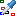

 [Data](../../data/data.md)

----

# SweepProbe

Lets assume that a model run does not yield a single number but a whole table and that we
want to create a simple 2D diagram to visualize the output of a Sweep study. In order to do so,
we should focus on a single cell of the output table and collect it over all model runs.   

The  SweepProbe loops over the output tables of a Sweep study,
picks a specific output value and maps it to the corresponding input values. The collected values 
yield a new table, including data from several model runs.  

The generated probe table can be understood as an intermediate step to visualize dependencies of
Sweep studies in terms of XySeries plots. 


## Source code

[./src/result/probe/sweepProbe.js](../../../../src/result/probe/sweepProbe.js)

## Demo

[./demo/study/probe/sweepProbeDemo.ipynb](../../../../demo/study/probe/sweepProbeDemo.ipynb)

## Construction
		
A new  SweepProbe is created either by: 

* using the context menu of a  [Data](../../data/data.md) atom in the [Tree View](../../../views/treeView.md) or
* calling the corresponding factory method of the  [Data](../../data/data.md) atom in the source code of the [Editor view](../../../views/editorView.md):

```javascript
    ...
    let sweepProbe = data.createSweepProbe();	     
```

## Properties

### Domain

#### Domain label

The header for the domain column of the created probe table. 

#### Domain range

What is the first or most important variable of your Sweep? Select a range of the Sweep study whose values should be used for the domain column of the generated probe table. 

For a one-dimensional sweep you only have to select this domain range. If you visualize the collected data as xy-Plot, this typically corresponds to the horizontal "x-axis". 

The SweepProbe supports up to three input variables. The collected output data is the typically visualized as a family of curves and the values of the higher order variables go into the plot legend instead of beeing represented by the domain axis. 

### First family

#### Legend for first family

Some text to be used in the legend to identify the first family/second variable. 

#### Range for first family

What is the second important variable of your Sweep? Select a range of the Sweep study whose values should be used for the first family column of the generated probe table. 

### Second family

#### Legend for second family

Some text to be used in the legend to identify the second family/third variable. 

#### Range for second family

What is the third important variable of your Sweep? Select a range of the Sweep study whose values should be used for the second family column of the generated probe table. 

### Probe

#### Probe label

The header for the probe column of the created probe table. 

#### Sweep output

The SweepOutput atom, representing the output of a Sweep study.

#### First probe table

The first otuput table that is considered for the probe. 

#### One based column index

Specifiy this number to identify the column from which probe value should be picked. 

#### One based row index

Specifiy this number to identify the row from which probe value should be picked. 

----

 [PickingProbe](./pickingProbe.md)

