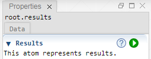

 [Root](../root.md)

----

# Results

The  Results atom represents a branch for all underlying result atoms. Creating the results is 
typically the last step in a simulation work flow. The purpose of the Results branch of the tree is to contain data that results from the execution of models and studies. The results branch is also the right place for create Probes and Graphics.  



## Source code

[./src/result/results.js](../../../src/result/results.js)

## Construction

A new  Results atom is created either 

* from the context menu of an existing  Root atom in the [Tree View](../../views/treeView.md) or 
* by calling the corresponding factory method of the  Root atom in the source code of the [Editor View](../../views/editorView.md):

```javascript
    ...
    let results = root.createResults();	     
```

## Child atoms

The context menu of the  Results atom allows to add child atoms: 

*  [Data](./data/data.md)
*  [Page](./page/page.md)


----
[Content](../../../README.md)
