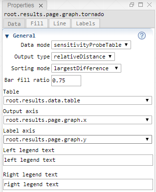
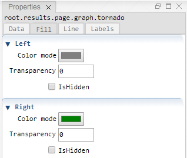
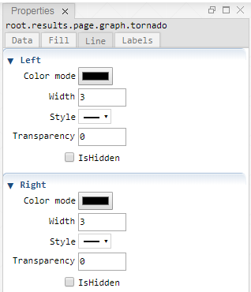
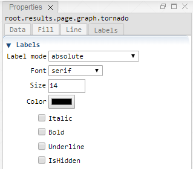

 [Graph](../graph/graph.md)

----

# Tornado

The  Tornado atom represents a tornado plot.<br>

## Source code

[./src/result/tornado/tornado.js](../../../../src/result/tornado/tornado.js)

## Demo

[./demo/result/tornado/tornadoDemo.ipynb](../../../../demo/result/tornado/tornadoDemo.ipynb)

## Construction
		
A new  Tornado is created either by: 

* using the context menu of a  [Graph](../graph/graph.md) atom in the [Tree View](../../../views/treeView.md) or
* calling the corresponding factory method of the  [Graph](../graph/graph.md) atom in the source code of the [Editor view](../../../views/editorView.md):

```javascript
    ...
    let tornado = graph.createTornado();	
```

# Screenshots of Property View

<table>

<tr>

</tr>	

<tr>

</tr>	

<tr>

</tr>	

<tr>

</tr>	

</table> 

----

 [Legend](../legend/legend.md)

