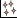
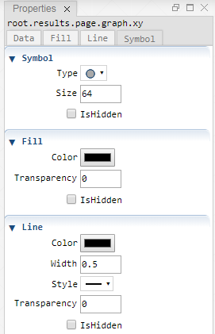

 [Graph](../graph/graph.md)

----

# Xy

The  Xy atom is used to plot points with lines. If wanted, only points or lines
can be shown. 

## Source code

[./src/result/xy/xy.js](../../../../src/result/xy/xy.js)

## Demo

[./demo/result/xy/xyDemo.ipynb](../../../../demo/result/xy/xyDemo.ipynb)

## Construction
		
A new  Xy is created either by: 

* using the context menu of a  [Graph](../graph/graph.md) atom in the [Tree View](../../../views/treeView.md) or
* calling the corresponding factory method of the  [Graph](../graph/graph.md) atom in the source code of the [Editor view](../../../views/editorView.md):

```javascript
    ...
    let xy = graph.createXy();	
```

# Screenshots of Property View

<table>
<tr>

</tr>	

<tr>

</tr>	

<tr>

</tr>	

<tr>
	
</tr>	

</table> 

----

 [XySeries](../xySeries/xySeries.md)

