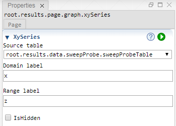

 [Graph](../graph/graph.md)

----

# XySeries

The  XySeries atom is used to generate a series of  Xy atoms from a table.<br>



## Source code

[./src/result/xySeries/xySeries.js](../../../../src/result/xySeries/xySeries.js)

## Demo

[./demo/result/xySeries/xySeriesDemo.ipynb](../../../../demo/result/xySeries/xySeriesDemo.ipynb)

## Construction
		
A new  XySeries is created either by: 

* using the context menu of a  [Graph](../graph/graph.md) atom in the [Tree View](../../../views/treeView.md) or
* calling the corresponding factory method of the  [Graph](../graph/graph.md) atom in the source code of the [Editor view](../../../views/editorView.md):

```javascript
    ...
    let xySeries = graph.createXySeries();	
```

# Properties

## XySeries

### Source table

### Domain label

### Range label

### IsHidden

----

 [Bar](../bar/bar.md)

