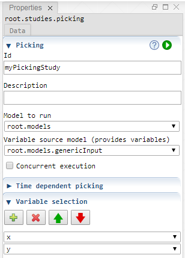

 [Studies](../studies.md)

----

# Picking
		
The purpose of the  Picking study is to execute a model several times while the input parameters are varied according to a list of parameter tubles. 



While the input of a  [Sweep](../sweep/sweep.md) can be imagined as a rigid rectangular grid in the domain, a  Picking study allows to pick only specific points from the domain. This is useful if you want to vary the density of selected points in the domain (one domain region might be more interesting than others) or walk through the domain on a curved path. 

For a time dependent picking study, you can imagine walking on a domain path while time is passing by. Then the location on the domain is a function of time and the corresponding model output is a function of time, too. 

## Source code

[./src/study/picking/picking.js](../../../../src/study/picking/picking.js)

## Demo

[./demo/study/picking/pickingDemo.ipynb](../../../../demo/study/picking/pickingDemo.ipynb)

## Construction
		
A new  Picking atom is created either by: 

* using the context menu of a  [Studies](../studies.md) atom in the [Tree View](../../../views/treeView.md) or
* calling the corresponding factory method of the  [Studies](../studies.md) atom in the source code of the [Editor view](../../../views/editorView.md):

```javascript
    ...
    let sweep = studies.createPicking();	     
```

## Work flow	

First define which variables you would like to pick values for, using the [Properties View](../../../views/propertiesView.md) of the Picking study. Then add some  [Samples](../sample/sample.md) as children of the Picking study to specify variable values. 

For a time dependent Picking study there is only a single Sample child. That time series Sample contains value arrays for the previously selected variables. 

You can **run** the  Picking atom either<br> 
a) with the  run button in the upper right corner of the [Properties View](../../../views/propertiesView.md)<br>
b) with the  run button in the context menu of the atom in the [Tree View](../../../views/treeView.md)<br>
c) with the  run button in the context menu of the parent  [Studies](../studies.md) atom in the [Tree View](../../../views/treeView.md) (runs all studies)<br>

## Child atoms
		
The context menu of the  Picking atom allows to add child atoms: 

*  [Sample](../sample/sample.md)
*  [PythonExport](../pythonExport/pythonExport.md)
*  [StudyInfoExport](../studyInfoExport/studyInfoExport.md)

The **samples** for a  Picking are defined through those child atoms. 

The samples can be **enabled/disabled** through their context menu. If a sample is disabled it is not included in the  Picking. 


## Sections

### Sensitivity

#### Id

Please enter a unique studyId that can be used to differentiate results of different studies in a result database.  

#### Description

A desription of the study. You might want to explain the purpose of the study, its assumptions ect. 

#### Model to run

The model that is executed by the Picking.

### Variable source model

The model that provides the variables that can be varied. Only the variables that are provided by this model and its sub models can be referenced by the samples of the Picking. 

The variable source model might be the same as the model to run.

## Time dependent picking

### Use time series

Set this check box to true if you would like to use a time dependent picking.

### Time variable

The variable that is used as time (e.g. root.models.genericInput.hour). 

### Time range

The values for the time variable (e.g. [1,2,3,4,5,6,7,8,9,10]). 

## Variable selection

Select the variables for which you would like to pick some sample values.

----

 [Sensitivity](../sensitivity/sensitivity.md)

