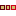
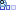

 [Studies](../studies.md)

----

# Picking
		
The purpose of the  Picking study is to execute a model several times while the input parameters are varied according to a list of parameter tubles. 

While the input of a [Sweep](../sweep/sweep.md) can be imagined as a rectangular grid in the domain, a Picking study is able to pick arbitrary points from the domain. This is for example useful if you want to vary the density of points in the domain; one domain region might be more intersting than another. 

For a time dependent picking study, you can imagine to walk on a path on the domain while time is passing by. The corresponding output of the model can be understood as a function of time. 

## Source code

[./src/study/picking/picking.js](../../../../src/study/picking/picking.js)

## Construction
		
A new  Picking atom is created either by: 

* using the context menu of a  [Studies](../studies.md) atom in the [Tree View](../../../views/treeView.md) or
* calling the corresponding factory method of the  [Studies](../studies.md) atom in the source code of the [Editor view](../../../views/editorView.md):

```javascript
    ...
    let sweep = studies.createPicking();	     
```

## Work flow	

You can **run** the  Picking atom either<br> 
a) with the  run button in the upper right corner of the [Properties View](../../../views/propertiesView.md)<br>
b) with the  run button in the context menu of the atom in the [Tree View](../../../views/treeView.md)<br>
c) with the  run button in the context menu of the parent  [Studies](../studies.md) atom in the [Tree View](../../../views/treeView.md) (runs all studies)<br>

## Child atoms
		
The context menu of the  Sweep atom allows to add child atoms: 

*  [DoubleRange](../../variable/range/doubleRange.md)
*  [IntegerRange](../../variable/range/integerRange.md)
*  [QuantityRange](../../variable/range/quantityRange.md)
*  [BooleanRange](../../variable/range/booleanRange.md)
*  [StringRange](../../variable/range/stringRange.md)
*  [StringItemRange](../../variable/range/stringItemRange.md)
*  [FilePathRange](../../variable/range/filePathRange.md)
*  [DirectoryPathRange](../../variable/range/directoryPathRange.md)
*  [PythonExport](../pythonExport/pythonExport.md)
*  [StudyInfoExport](../studyInfoExport/studyInfoExport.md)

The **ranges** for a  Sweep are defined through those child atoms. 

The ranges can be **enabled/disabled** through their context menu. If a range is disabled it is not included in the  Sweep. 

## Simulation order

If there are for example two parameter ranges [10,20,30,40], [100,200], you can imagine a 4 x 2 table or a grid with 8 nodes, where each node represents the input for a job (e.g. {10,100} or {30,200}). The first value of the first range (e.g. 10) is included in the first job. That value is kept constant while the remaining range is varied.


The numbers 1...8 represent the simulation order (="jobId"). A sweep can also be understood as a tree structure, where the elements of the first range build the main tree nodes, the elements of the second range build sub level tree nodes and so on. Each existing path in the tree (e.g. 10 => 100 or 30 => 200) corresponds to an individual job of the  Sweep study.


## Sections

### Sweep

#### Id

Please enter a unique studyId that can be used to differentiate results of different studies in a result database.  

#### Description

A desription of the study. You might want to explain the purpose of the study, its assumptions ect. 

#### Model to run

The model that is executed by the Sweep.

### Variable source model

The model that provides the variables that can be varied. Only the variables that are provided by this model and its sub models can be referenced by the variable ranges of the sweep. 

The variable source model might be the same as the model to run.

----

 [Picking](../picking/picking.md)

