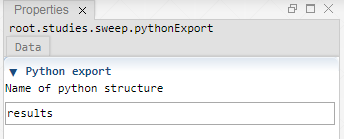

 [Sweep](../sweep/sweep.md)

----

# PythonExport
  
The purpose of the  PythonExport atom is to export results of a study to the python kernel of the [Jupyter Notebook](../../../installation/jupyterInstallation.md). 

This atom requires python support and is not supported in the Stand-alone installation.

Lets assume that each job of a sweep generates a table (due to a  [TableImport](../../model/tableImport/tableImport.md) atom). The  PythonExport atom exports that table to the python kernel and puts it in a data structure. That data structure is called "results" by default (its name can be modified if wanted).

The results data structure is compatible to the [EMA workbench](https://emaworkbench.readthedocs.io/en/latest/indepth_tutorial/general-introduction.html?highlight=results#Processing-the-results-of-the-experiments):

>By default, the return of perform_experiments is a tuple of length 2. The first item in the tuple is the experiments. The second item is the outcomes. Experiments and outcomes are aligned by index. 

```
experiments, outcomes = results;
```

Therefore, the evaluation methods of the EMA workbench can be applied to the results structure that is exported by the  PythonExport atom.


		
## Source code

[./src/study/pythonExport/pythonExport.js](../../../../src/study/pythonExport/pythonExport.js)

## Construction
		
A new  PythonExport atom is created either by: 

* using the context menu of a study (for example  [Sweep](../sweep/sweep.md)) in the [Tree View](../../../views/treeView.md) or
* calling the corresponding factory method of the study atom in the source code of the [Editor view](../../../views/editorView.md):

```javascript
    ...
    var pythonExport = sweep.createPythonExport();	     
```

## Work flow	

A  PythonExport atom is automatically executed if it exists as child of a study and the study is executed. It is not possible to manually run a  PythonExport atom.

Once the study has been finished, you can add extra cells to the Python Notebook and access the results structure. 
      
## Sections

### Python export

#### Name of python structure

Enter the name of the python data structure to generate. The default name is "results".

----

 [StudyInfoExport](../studyInfoExport/studyInfoExport.md)
