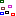
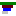

 [Studies](../studies.md)

----

# Sample
		
The purpose of the  Sample atom is to specify variable values for 
a  [Picking](../picking/picking.md) study. Add several samples if
you would like to run the controlled model several times. 


A time dependent Picking study only supports a single Sample, where the time series for the variables
are specified as arrays:


## Source code

[./src/study/sample/sample.js](../../../../src/study/sample/sample.js)

## Demo

[./demo/study/sample/sampleDemo.ipynb](../../../../demo/study/sample/sampleDemo.ipynb)

## Construction
		
A new  Sample atom is created either by: 

* using the context menu of a  [Picking](../picking/picking.md) study in the [Tree View](../../../views/treeView.md) or
* calling the corresponding factory method of the  [Picking](../picking/picking.md) study in the source code of the [Editor view](../../../views/editorView.md):

```javascript
    ...
    let sample = picking.createSample();	     
```

## Work flow	

First define which variables you would like to pick values for in the Picking study. Then add Then add some
 [Samples](../sample/sample.md) as children of the Picking study.
Click on a sample to show its properties in the [Properties View](../../../views/propertiesView.md) and specify some values. 

----

 [Sensitivity](../sensitivity/sensitivity.md)

