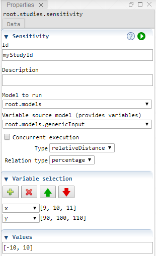

 [Studies](../studies.md)

----

# Sensitivity
		
The purpose of the  Sensitivity study is to execute a model several times while the input parameters are varied. 

The Sensitivity study starts with a working point in the domain and then deviates from that working point by altering individual variables at a time. This way, the study investigates the sensitivity of the model output in relation to the varied variables. 



While the input of a  [Sweep](../sweep/sweep.md) study can be imagined as a broad rectangular grid in the domain, a  Sensitivity study typically investigates only the direct neighborhood of a working point. 

In ordert to illustrate the results of a Sensitivity study you might want to use a  [Tornado](../../result/tornado/tornado.md) chart. 

## Source code

[./src/study/sensitivity/sensitivity.js](../../../../src/study/sensitivity/sensitivity.js)

## Demo

[./demo/study/sensitivity/sensitivityDemo.ipynb](../../../../demo/study/sensitivity/sensitivityDemo.ipynb)

## Construction
		
A new  Sensitivity atom is created either by: 

* using the context menu of a  [Studies](../studies.md) atom in the [Tree View](../../../views/treeView.md) or
* calling the corresponding factory method of the  [Studies](../studies.md) atom in the source code of the [Editor view](../../../views/editorView.md):

```javascript
    ...
    let sensitivity = studies.createSensitivity();	     
```

## Work flow	

You can **run** the  Sensitivity atom either<br> 
a) with the  run button in the upper right corner of the [Properties View](../../../views/propertiesView.md)<br>
b) with the  run button in the context menu of the atom in the [Tree View](../../../views/treeView.md)<br>
c) with the  run button in the context menu of the parent  [Studies](../studies.md) atom in the [Tree View](../../../views/treeView.md) (runs all studies)<br>

## Child atoms
		
The context menu of the  Sensitivity atom allows to add child atoms: 

*  [PythonExport](../pythonExport/pythonExport.md)
*  [StudyInfoExport](../studyInfoExport/studyInfoExport.md)

## Properties

### Sensitivity

#### Id

Please enter a unique studyId that can be used to differentiate results of different studies in a result database.  

#### Description

A desription of the study. You might want to explain the purpose of the study, its assumptions ect. 

#### Model to run

The model that is executed by the Sensitivity.

### Variable source model

The model that provides the variables that can be varied. Only the variables that are provided by this model and its sub models can be referenced by the samples of the Sensitivity. 

The variable source model might be the same as the model to run.

### Type

In relation to the working point, you can specify the variable values either using

* **relativeDistance** (default): Specify variation using relative distance of neighboring points to working point {p}: specify "how far" the other points are away, e.g. the distance is -10 %, 10 % of the absolute working point value => (p-p*0.1), {p}, (p+p*0.1)

* **relativePosition**: Specify variation using positions of neighboring points in relation to the working point {p} : specify "where" the other points are, e.g.the position is 90 %, 110 % of the absolute working point value => (0.9*p), {p}, (1.1*p)

* **absoluteDistance**: Specify variation using absolute distance of neighboring points e.g. -5, 10 for a working point value of {p=10} => 5, {p=10}, 20

### Relation type

If you choose some relative type, you can specify the variable values either using

* **percentage** (default): Specify values indirectly, in terms of percentages in relation to the working point value, e.g. a percentage of 10 with a working point value of 1000 gives a final value of 1000 * 10/100 = 100.

* **factor**: Specify values indirectly, in terms of factors in relation to the working point value, e.g. a factor of 0.1 with a working point value of 1000 gives a final value of 0.1 * 1000 = 100.
	
* **expontent**: Specify values indirectly, in terms of a change in exponent (magnitude, order), e.g. an exponent of 2 with a working point value of 100 gives a final value of 10^2 * 1000 = 100.000

## Variable selection

Select the variables you would like to vary. On the right side there is a preview of the considered variable values. The working point is determined by the default values of the model and the working point values are also included in the preview. 

## Values

Enter some numbers that are used to vary the variable values. The interpretation of that numbers depends on the previously selected type and relation type. 

----

 [Probability](../probability/probability.md)

