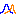

 [Studies](../studies.md)

----

# Sensitivity
		
The purpose of the  Sensitivity study is to execute a model several times while the input parameters are varied. 

The Sensitivity study starts with a working point in the domain and then deviates from that working point by altering individual variables at a time. This way, the study investigates the sensitivity of the model output in relation to the varied variables. 


While the input of a  [Sweep](../sweep/sweep.md) study can be imagined as a broad rectangular grid in the domain, a  Sensitivity study typically investigates only the direct neighborhood of a working point. 

In ordert to illustrate the results of a Sensitivity study you might want to use a  [Tornado](../../result/tornado/tornado.md) chart. 

## Source code

[./src/study/sensitivity/sensitivity.js](../../../../src/study/sensitivity/sensitivity.js)

## Demo

[./demo/study/sensitivity/sensitivityDemo.ipynb](../../../../demo/study/sensitivity/sensitivityDemo.ipynb)

## Construction
		
A new  Sensitivity atom is created either by: 

* using the context menu of a  [Studies](../studies.md) atom in the [Tree View](../../../views/treeView.md) or
* calling the corresponding factory method of the  [Studies](../studies.md) atom in the source code of the [Editor view](../../../views/editorView.md):

```javascript
    ...
    let sensitivity = studies.createSensitivity();	     
```

## Work flow	

You can **run** the  Sensitivity atom either<br> 
a) with the  run button in the upper right corner of the [Properties View](../../../views/propertiesView.md)<br>
b) with the  run button in the context menu of the atom in the [Tree View](../../../views/treeView.md)<br>
c) with the  run button in the context menu of the parent  [Studies](../studies.md) atom in the [Tree View](../../../views/treeView.md) (runs all studies)<br>

## Child atoms
		
The context menu of the  Sensitivity atom allows to add child atoms: 

*  [PythonExport](../pythonExport/pythonExport.md)
*  [StudyInfoExport](../studyInfoExport/studyInfoExport.md)

## Sections

### Sensitivity

#### Id

Please enter a unique studyId that can be used to differentiate results of different studies in a result database.  

#### Description

A desription of the study. You might want to explain the purpose of the study, its assumptions ect. 

#### Model to run

The model that is executed by the Sensitivity.

### Variable source model

The model that provides the variables that can be varied. Only the variables that are provided by this model and its sub models can be referenced by the samples of the Sensitivity. 

The variable source model might be the same as the model to run.

## Time dependent picking

### Use time series

Set this check box to true if you would like to use a time dependent picking.

### Time variable

The variable that is used as time (e.g. root.models.genericInput.hour). 

### Time range

The values for the time variable (e.g. [1,2,3,4,5,6,7,8,9,10]). 

## Variable selection

Select the variables for which you would like to pick some sample values.

----

 [Probability](../probability/probability.md)

