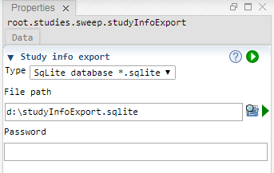
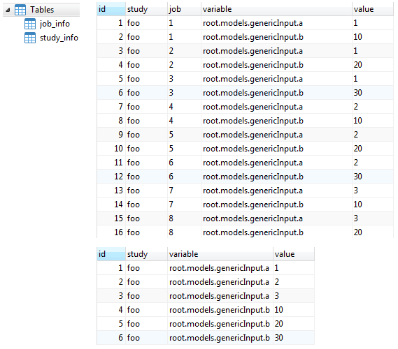

 [Sweep](../sweep/sweep.md)

----

# StudyInfoExport
  
The purpose of the  StudyInfoExport atom is to export meta information about a study to a text file or a database. This might be helpful if you would like to know which variable values belong to which jobId. 

If you select a database type for the export, two tables "study_info" and "job_info" will be created (if they do not yet exist) in the database.


		
## Source code

[./src/study/studyInfoExport/studyInfoExport.js](../../../../src/study/studyInfoExport/studyInfoExport.js)

## Construction
		
A new  StudyInfoExport atom is created either by: 

* using the context menu of a study (for example  [Sweep](../sweep/sweep.md)) in the [Tree View](../../../views/treeView.md) or
* calling the corresponding factory method of the study atom in the source code of the [Editor view](../../../views/editorView.md):

```javascript
    ...
    let studyInfoExport = sweep.createStudyInfoExport();	     
```

## Work flow	

You can **run** the  StudyInfoExport atom either<br> 
a) with the  run button in the upper right corner of the [Properties View](../../../views/propertiesView.md)<br>
b) with the  run button in the context menu of the atom in the [Tree View](../../../views/treeView.md)<br>
c) with the  run button in the context menu of the parent study atom in the [Tree View](../../../views/treeView.md) (runs the study and executes its excutable children)<br>
      
## Sections

### Study info export

#### Type

Select if you would like to export the study info to:
* Text file *.txt
* SqLite database *.sqlite
* MySql database

Depending on the type, following input fields might be visible or hidden. 

#### File path

The path to a text file or SqLite database file, depending on the previously selected type.

#### Host

The host name or IP address of a MySQL server, for example "fooserver" or "153.96.123.456".

#### Port

The port number of a MySQL server, for example 3306.

#### Schema name

A single MySQL database can include several "sub databases", called "schema".
Please specifiy the name of the schema that contains the table you would like
to import. 

#### User

The user name, for example "root". 

#### Password

A password only needs to be specified if a source database is password protected.

## Example output

### Text file

```
---------- StudyInfo ----------

#Total number of simulations:
9

#Variable model paths and values:

root.models.genericInput.a
1
2
3

root.models.genericInput.b
10
20
30

---------- JobInfo ------------

jobId: 1
root.models.genericInput.a: 1
root.models.genericInput.b: 10

jobId: 2
root.models.genericInput.a: 1
root.models.genericInput.b: 20

jobId: 3
root.models.genericInput.a: 1
root.models.genericInput.b: 30

jobId: 4
root.models.genericInput.a: 2
root.models.genericInput.b: 10

jobId: 5
root.models.genericInput.a: 2
root.models.genericInput.b: 20

jobId: 6
root.models.genericInput.a: 2
root.models.genericInput.b: 30

jobId: 7
root.models.genericInput.a: 3
root.models.genericInput.b: 10

jobId: 8
root.models.genericInput.a: 3
root.models.genericInput.b: 20

jobId: 9
root.models.genericInput.a: 3
root.models.genericInput.b: 30
```

### Database



----

 [Results](../../result/results.md)
