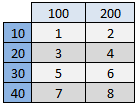
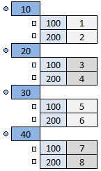

 [Studies](../studies.md)

----

# Sweep
		
The purpose of the  Sweep study is to execute a model several times while the input parameters are varied according to a list of parameter ranges. 

The input of a Sweep can be imagined as a rectangular grid or matrix (see below) in the domain. Every node of that rectangular grid is used. In comparison, a  [Picking](../picking/picking.md) study might not use every node on a grid and the grid does not need to be rectangular.    

The execution of a model is also called a "model run" or a "job". The model that is controlled by a  Sweep might consist of several sub models.

## Source code

[./src/study/sweep/sweep.js](../../../../src/study/sweep/sweep.js)

## Construction
		
A new  Sweep atom is created either by: 

* using the context menu of a  [Studies](../studies.md) atom in the [Tree View](../../../views/treeView.md) or
* calling the corresponding factory method of the  [Studies](../studies.md) atom in the source code of the [Editor view](../../../views/editorView.md):

```javascript
    ...
    var sweep = studies.createSweep();	     
```

## Work flow	

You can **run** the  Sweep atom either<br> 
a) with the  run button in the upper right corner of the [Properties View](../../../views/propertiesView.md)<br>
b) with the  run button in the context menu of the atom in the [Tree View](../../../views/treeView.md)<br>
c) with the  run button in the context menu of the parent  [Studies](../studies.md) atom in the [Tree View](../../../views/treeView.md) (runs all studies)<br>

## Child atoms
		
The context menu of the  Sweep atom allows to add child atoms: 

*  [DoubleRange](../../variable/range/doubleRange.md)
*  [IntegerRange](../../variable/range/integerRange.md)
*  [QuantityRange](../../variable/range/quantityRange.md)
*  [BooleanRange](../../variable/range/booleanRange.md)
*  [StringRange](../../variable/range/stringRange.md)
*  [StringItemRange](../../variable/range/stringItemRange.md)
*  [FilePathRange](../../variable/range/filePathRange.md)
*  [DirectoryPathRange](../../variable/range/directoryPathRange.md)


## Simulation order

If there are for example two parameter ranges [10,20,30,40], [100,200], you can imagine a 4 x 2 table or a grid with 8 nodes, where each node represents the input for a job (e.g. {10,100} or {30,200}). The first value of the first range (e.g. 10) is included in the first job. That value is kept constant while the remaining range is varied.



The numbers 1...8 represent the simulation order (="jobId"). A sweep can also be understood as a tree structure, where the elements of the first range build the main tree nodes, the elements of the second range build sub level tree nodes and so on. Each existing path in the tree (e.g. 10 => 100 or 30 => 200) corresponds to an individual job.




## Attributes

<ul>
<li><b>Model to run</b>: the model that is executed by the sweep.</li>
<li><b>Variable source model</b>: the model that provides the variables that can be varied. Only the variables that are provided by
              this model and its sub models can be referenced by the variable ranges of the sweep. The variable source model might 
              be the same as the model to run.</li>
<li><b>Export sweep information</b>: if this is true, information about the sweep (total number of simulations, range values) will 
              be exported to a text file. </li>
<li><b>Target file path for sweep information</b>: the path to a text file, e.g. C:\sweepdata.txt, where the sweep information
              is exported. If the option <b>Export sweep information</b> is false, this argument is disabled and not used.</li>
</ul>

<h3>Ranges</h3>

The ranges for a <a class = "sweep"></a> atom are defined through child atoms. 
The context menu of the <a class = "sweep"></a> atom allows you to add new children and you
can also add range atoms by adapting the source code. There exist several kinds of ranges
which differ in the type of the individual values they include:

<ul>
<li><a class="quantityVariableRange"></a></li>
<li><a class="doubleVariableRange"></a></li>
<li><a class="booleanVariableRange"></a></li>
<li><a class="stringVariableRange"></a></li>
<li><a class="filePathVariableRange"></a></li>
<li><a class="directoryPathVariableRange"></a></li>
</ul>

The ranges can be enabled/disabled through their context menu. If a range is disabled it is
not included in the sweep. 


</body>
