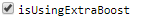

 [GenericInput](../../model/genericInput/genericInput.md)

----

# BooleanVariable

The  BooleanVariable atom is used to specify a boolean value, e.g. True or False: 



## Source code

[./src/variable/field/booleanVariable.js](../../../../src/variable/field/booleanVariable.js)

## Construction

A new  BooleanVariable atom is created either 

* from the context menu of a  [GenericInput](../../model/genericInput/genericInput.md) atom in the [Tree View](../../../views/treeView.md) or 

* by calling the corresponding factory method of a parent atom in the source code of the [Editor View](../../../views/editorView.md):	

```javascript
    ...
    var length = genericInput.createBooleanVariable('isUsingExtraBoost', True);
```

----
 [StringVariable](./stringVariable.md)
