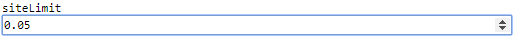

 [GenericInput](../../model/genericInput/genericInput.md)

----

# DoubleVariable

The  DoubleVariable atom is used to specify a double input value (=floating point number) for a model, e.g. for a  [GenericInput](../../model/genericInput/genericInput.md) model):



The **number format** might depend on the language settings of your Google Chrome browser (e.g. "." for English and "," for German or French settings). In order to be **consistent** with the point-**decimal separator** that is used for numbers in the the source code of the [Editor View](../../views/editorView), we recomment to use "English (United States)" as language: Settings => Advanced => Languages => "English (United States)". 

The arrow buttons on the right side of the input field increase/decrease the number by 1.0. 

## Source code

[./src/variable/field/doubleVariable.js](../../../../src/variable/field/doubleVariable.js)

## Construction

A new  DoubleVariable atom is created either 

* from the context menu of a  [GenericInput](../../model/genericInput/genericInput.md) atom in the [Tree View](../../../views/treeView.md) or 

* by calling the corresponding factory method of a parent atom in the source code of the [Editor View](../../../views/editorView.md):	

```javascript
    ...
    genericInput.createDoubleVariable('siteLimit', 0.05);
```

----
 [IntegerVariable](./integerVariable.md)
