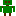

 [GenericInput](../../model/genericInput/genericInput.md)

----

# DoubleVariable

The  DoubleVariable atom is used to specify a double value (=floating point number)

(for example for a  [GenericInput](../../model/genericInput/genericInput.md) atom):


In order to be **consistent** with the point-**decimal separator** that is used for numbers in the the source code of the [Editor View](../../views/editorView), we recomment to set the language settings of the browser UI (e.g. Google Chrome) to "English (United States)": Settings => Advanced => Languages => "English (United States)". 

## Source code

[./src/variable/field/doubleVariable.js](../../../../src/variable/field/doubleVariable.js)

## Construction

A new  DoubleVariable atom is created either 

* from the context menu of an existing  [GenericInput](../../model/genericInput/genericInput.md) atom in the [Tree View](../../../views/treeView.md) or 

* by calling the corresponding factory method of a parent atom in the source code of the [Editor View](../../../views/editorView.md):	

```javascript
    ...
    genericInput.createDoubleVariable('siteLimit', 0.05);
```

----
 [IntegerVariable](./integerVariable.md)
