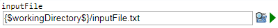

 [Path](../../model/path/path.md)
 [GenericInput](../../model/genericInput/genericInput.md)

----

# FilePathVariable

The  FilePathVariable atom is used to specify file paths (for example as part of a  [Path](../../model/path/path.md) or  [GenericInput](../../model/genericInput/genericInput.md) atom.



You can **edit** the file path by
* entering the path directly in the text field
* clicking on the  selection button. That opens an extra file selection dialog.

You can **open/execute** the file by clicking on the  run button.

## Source code

[./src/variable/field/filePathVariable.js](../../../../src/variable/field/filePathVariable.js)

## Construction

A new  FilePathVariable atom is created either 

* from the context menu of an existing  [Path](../../model/path/path.md) or  [GenericInput](../../model/genericInput/genericInput.md) atom in the [Tree View](../../../views/treeView.md) or 

* by calling the corresponding factory method in the source code of the [Editor View](../../../views/editorView.md):	

```javascript
    ...
    var path = models.createPath();	   
    path.createFilePathVariable('inputFile', '{$workingDirectory$}\input.txt');
```

----
 [DirectoryPathVariable](./directoryPathVariable.md)
